Landscape analysis example
================
Trond Simensen
31 10 2019

All four axes in the 4-dimensional GNMDS ordination of the KS457 dataset
were confirmed by DCA. GNMDS ordination had Procrustes SS = 0.0363 and
seven unstable OUs (which switched positions between the two best GNMDS
solutions).

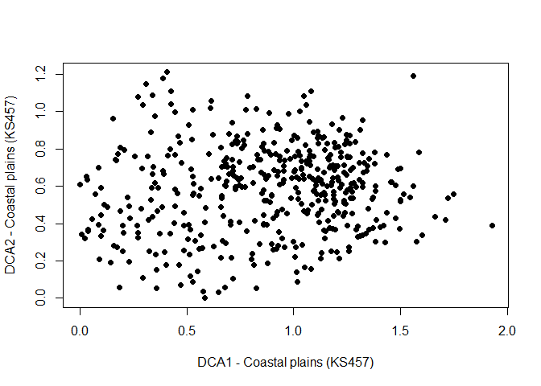<!-- -->

There were no visible artifacts in the ordination charts. The
correlation analysis, the vector charts and the iso-line charts show a
strong first axis related to land use (infrastructure and agricultural
character) that appears to be conditioned by an underlying
geo-ecological gradient from inner to outer coast. Second axis is
strongly related to relief.

| Landscape variable | GNMDS 1   | GNMDS 2   | GNMDS 3   | GNMDS 4   |
| :----------------- | :-------- | :-------- | :-------- | :-------- |
| Gab\_nae           | 0.63448   | \-0.11638 | \-0.02938 | \-0.00919 |
| Gab\_fi            | 0.31661   | \-0.06816 | 0.15763   | \-0.06074 |
| Gab\_a             | 0.73279   | \-0.05137 | \-0.06316 | \-0.03971 |
| Flat\_a            | \-0.09196 | \-0.56256 | 0.2041    | 0.13327   |
| Vmag\_a            | 0.63448   | \-0.11638 | \-0.02938 | \-0.00919 |
| Vei\_b\_a          | 0.31661   | \-0.06816 | 0.15763   | \-0.06074 |
| Ktkmo\_a           | 0.73279   | \-0.05137 | \-0.06316 | \-0.03971 |
| Tpi1l\_a           | \-0.09196 | \-0.56256 | 0.2041    | 0.13327   |
| Tpi1h\_a           | 0.63448   | \-0.11638 | \-0.02938 | \-0.00919 |
| Tpi1\_mp           | 0.31661   | \-0.06816 | 0.15763   | \-0.06074 |
| Stroms\_a          | 0.73279   | \-0.05137 | \-0.06316 | \-0.03971 |
| Stromn\_a          | \-0.09196 | \-0.56256 | 0.2041    | 0.13327   |
| Stroml\_a          | 0.63448   | \-0.11638 | \-0.02938 | \-0.00919 |
| River\_a           | 0.31661   | \-0.06816 | 0.15763   | \-0.06074 |
| Sti\_a             | 0.73279   | \-0.05137 | \-0.06316 | \-0.03971 |
| Steep\_a           | \-0.09196 | \-0.56256 | 0.2041    | 0.13327   |
| Kskred\_a          | 0.63448   | \-0.11638 | \-0.02938 | \-0.00919 |
| Setr\_s            | 0.31661   | \-0.06816 | 0.15763   | \-0.06074 |
| Sefr\_a            | 0.73279   | \-0.05137 | \-0.06316 | \-0.03971 |
| Rug3\_m            | \-0.09196 | \-0.56256 | 0.2041    | 0.13327   |
| Rr1\_m             | 0.63448   | \-0.11638 | \-0.02938 | \-0.00919 |
| Brich\_a           | 0.31661   | \-0.06816 | 0.15763   | \-0.06074 |
| Bpoor\_a           | 0.73279   | \-0.05137 | \-0.06316 | \-0.03971 |
| Rd\_anl\_a         | \-0.09196 | \-0.56256 | 0.2041    | 0.13327   |
| Bplu\_a            | 0.63448   | \-0.11638 | \-0.02938 | \-0.00919 |
| Bvul\_a            | 0.31661   | \-0.06816 | 0.15763   | \-0.06074 |
| Bavstn\_a          | 0.73279   | \-0.05137 | \-0.06316 | \-0.03971 |
| Bomd\_a            | \-0.09196 | \-0.56256 | 0.2041    | 0.13327   |
| Land\_a            | 0.63448   | \-0.11638 | \-0.02938 | \-0.00919 |
| Build\_a           | 0.31661   | \-0.06816 | 0.15763   | \-0.06074 |
| City\_a            | 0.73279   | \-0.05137 | \-0.06316 | \-0.03971 |
| Mire\_a            | \-0.09196 | \-0.56256 | 0.2041    | 0.13327   |
| Meant\_a           | 0.63448   | \-0.11638 | \-0.02938 | \-0.00919 |
| Maro\_s            | 0.31661   | \-0.06816 | 0.15763   | \-0.06074 |
| Kmar\_a            | 0.73279   | \-0.05137 | \-0.06316 | \-0.03971 |
| Lled\_a            | \-0.09196 | \-0.56256 | 0.2041    | 0.13327   |
| Klac\_a            | 0.63448   | \-0.11638 | \-0.02938 | \-0.00919 |
| Kelv\_a            | 0.31661   | \-0.06816 | 0.15763   | \-0.06074 |
| Kbf\_a             | 0.73279   | \-0.05137 | \-0.06316 | \-0.03971 |
| Lake\_a            | \-0.09196 | \-0.56256 | 0.2041    | 0.13327   |
| Innoy\_s           | 0.63448   | \-0.11638 | \-0.02938 | \-0.00919 |
| Er\_m              | 0.31661   | \-0.06816 | 0.15763   | \-0.06074 |
| R\_net\_a          | 0.73279   | \-0.05137 | \-0.06316 | \-0.03971 |
| Ekspve\_a          | \-0.09196 | \-0.56256 | 0.2041    | 0.13327   |
| Ekspmo\_a          | 0.63448   | \-0.11638 | \-0.02938 | \-0.00919 |
| Ekspbe\_a          | 0.31661   | \-0.06816 | 0.15763   | \-0.06074 |
| Inns\_s            | 0.73279   | \-0.05137 | \-0.06316 | \-0.03971 |
| Cul\_u\_s          | \-0.09196 | \-0.56256 | 0.2041    | 0.13327   |
| Cul\_t\_s          | 0.63448   | \-0.11638 | \-0.02938 | \-0.00919 |
| Cul\_m\_s          | 0.31661   | \-0.06816 | 0.15763   | \-0.06074 |
| Cul\_k\_s          | 0.73279   | \-0.05137 | \-0.06316 | \-0.03971 |
| Cul\_b\_s          | \-0.09196 | \-0.56256 | 0.2041    | 0.13327   |
| Cul\_a\_s          | 0.63448   | \-0.11638 | \-0.02938 | \-0.00919 |
| Cre\_b\_a          | 0.31661   | \-0.06816 | 0.15763   | \-0.06074 |
| Cre\_f\_a          | 0.73279   | \-0.05137 | \-0.06316 | \-0.03971 |
| Crug3\_m           | \-0.09196 | \-0.56256 | 0.2041    | 0.13327   |
| Crug9\_m           | 0.63448   | \-0.11638 | \-0.02938 | \-0.00919 |
| Cr3\_u\_a          | 0.31661   | \-0.06816 | 0.15763   | \-0.06074 |
| Cr3\_r\_a          | 0.73279   | \-0.05137 | \-0.06316 | \-0.03971 |
| Ccom\_m            | \-0.09196 | \-0.56256 | 0.2041    | 0.13327   |
| C\_kk\_a           | 0.63448   | \-0.11638 | \-0.02938 | \-0.00919 |
| C\_ek\_a           | 0.31661   | \-0.06816 | 0.15763   | \-0.06074 |
| Bohei\_a           | 0.73279   | \-0.05137 | \-0.06316 | \-0.03971 |
| Asp\_s\_a          | \-0.09196 | \-0.56256 | 0.2041    | 0.13327   |
| Asp\_n\_a          | 0.63448   | \-0.11638 | \-0.02938 | \-0.00919 |
| Abygg\_a           | 0.31661   | \-0.06816 | 0.15763   | \-0.06074 |
| Araaf\_a           | 0.73279   | \-0.05137 | \-0.06316 | \-0.03971 |
| Arbar\_a           | \-0.09196 | \-0.56256 | 0.2041    | 0.13327   |
| Arbla\_a           | 0.63448   | \-0.11638 | \-0.02938 | \-0.00919 |
| Arfull\_a          | 0.31661   | \-0.06816 | 0.15763   | \-0.06074 |
| Arlov\_a           | 0.73279   | \-0.05137 | \-0.06316 | \-0.03971 |
| Arover\_a          | \-0.09196 | \-0.56256 | 0.2041    | 0.13327   |
| Dismire            | 0.63448   | \-0.11638 | \-0.02938 | \-0.00919 |
| Dislake            | 0.31661   | \-0.06816 | 0.15763   | \-0.06074 |
| Discoast           | 0.73279   | \-0.05137 | \-0.06316 | \-0.03971 |
| Guro\_t\_a         | \-0.09196 | \-0.56256 | 0.2041    | 0.13327   |
| Tpi6l\_a           | 0.63448   | \-0.11638 | \-0.02938 | \-0.00919 |
| Sn\_imp            | 0.31661   | \-0.06816 | 0.15763   | \-0.06074 |
| Sn\_flekk          | 0.73279   | \-0.05137 | \-0.06316 | \-0.03971 |
| Sn\_lav            | \-0.09196 | \-0.56256 | 0.2041    | 0.13327   |
| Sn\_torr           | 0.63448   | \-0.11638 | \-0.02938 | \-0.00919 |
| Sn\_frisk          | 0.31661   | \-0.06816 | 0.15763   | \-0.06074 |
| Sn\_ureg           | 0.73279   | \-0.05137 | \-0.06316 | \-0.03971 |
| Oyst\_i            | \-0.09196 | \-0.56256 | 0.2041    | 0.13327   |

Correlation between landscape variables and
ordination-axes

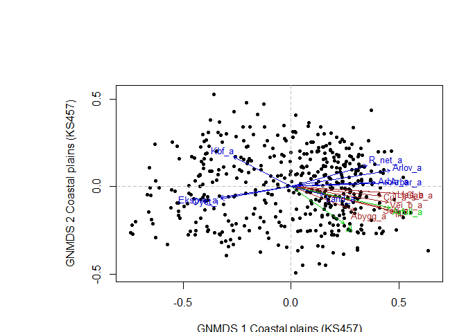<!-- -->

# Interpretation

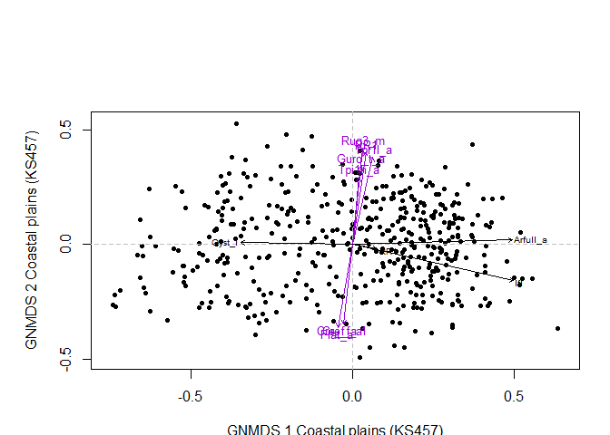<!-- -->

## Header 2

Complementary observations, axis 1 and 2:

-----

  - One OU belongs to OI Class 6 (big city). This is Id 2916 Oslo city,
    which occupies the extreme position along GNMDS axis 1.
  - Agricultural intensity is associated with positive scores for GNMDS
    1, and a certain degree of infrastructure (similar to IfI ≈ 4) is a
    prerequisite for amount/degree of agricultural land use intensity.
    The relationship between JI and IfI is slightly unimodal, that is,
    the agricultural land use intensity is strongest when the
    amount/degree of infrastructure is relatively high, but decreases
    again when the amount/degree of infrastructure is very high.
  - The proportion of the area with deciduous forest (Arlov\_a) is 0 at
    the outer parts of the archipelago (SN = 5; there are 156 OUs with
    Arlov = 0), but increases inward towards larger islands and on the
    mainland.
  - The figure at the bottom left shows a clear (inverse) island size
    gradient, with a considerable variation in landscape characteristics
    related to the archipelago properties, first and foremost when the
    islands are smaller than 100 km2 (Oyst\_i \> 0.643). This opens the
    possibility that the complex gradient expressed on axis 1 is
    actually composed of two CLGs.
  - Among the 69 OUs in KS lacking infrastructure (IfI = 0), all of the
    56 as a largest island smaller than 1 km. Islands with significant
    infrastructure are generally much larger; one exception is Id 4038
    which has Oyst\_i = 0.8647 and IfI = 9.34. This polygon is located
    on the west and south part of Nøtterøy.
  - It is noteworthy that the topographic variables give such a strong
    signal when there is so little topography variation within costal
    plains.

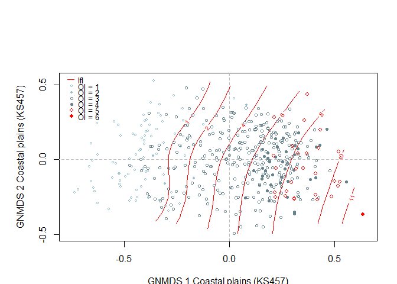<!-- -->

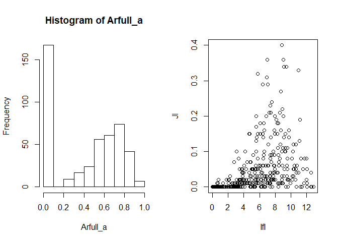<!-- -->

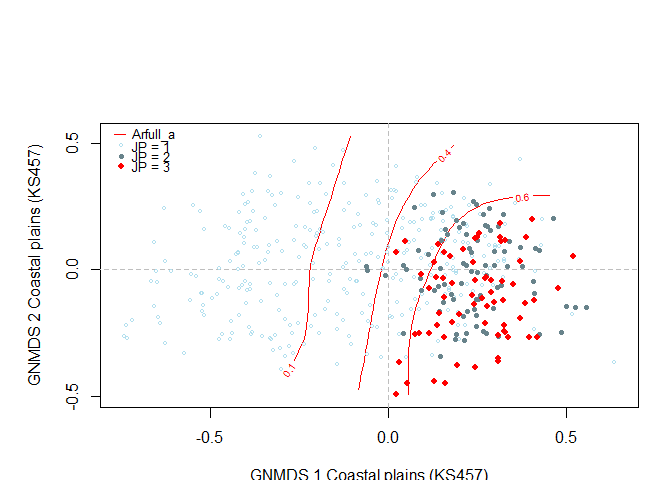<!-- -->

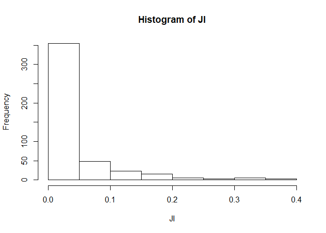<!-- -->

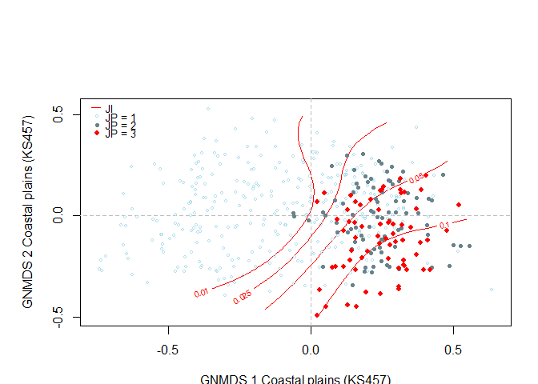<!-- -->

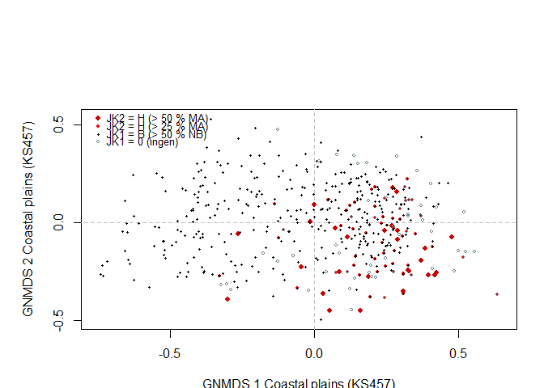<!-- -->

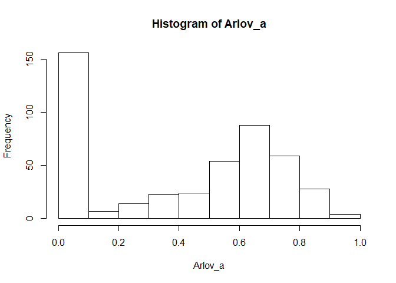<!-- -->

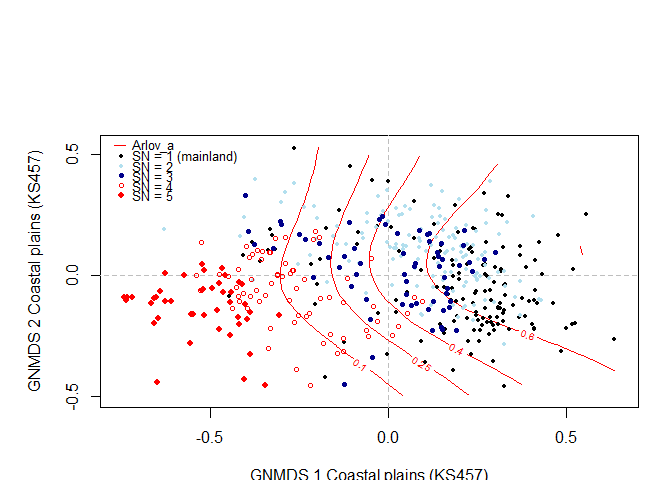<!-- -->

<!-- -->

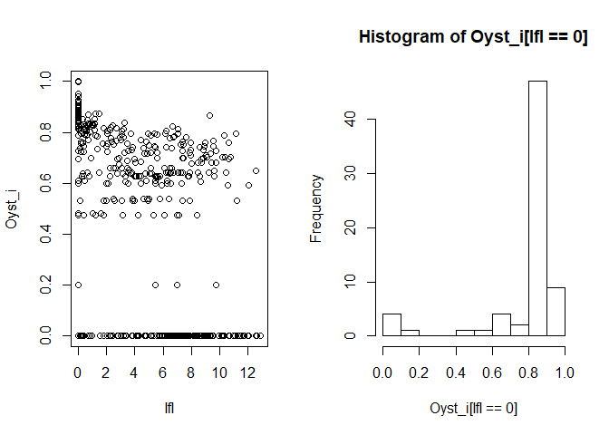<!-- -->
