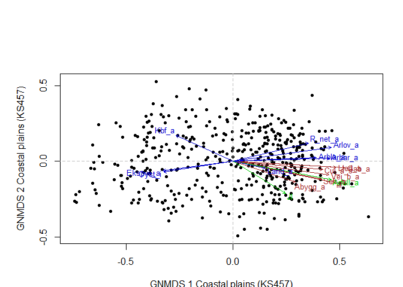
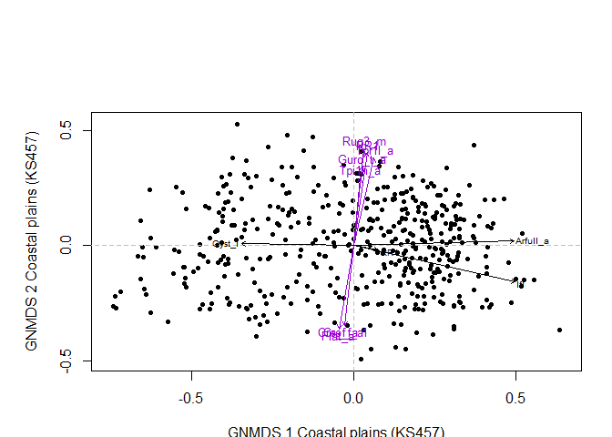
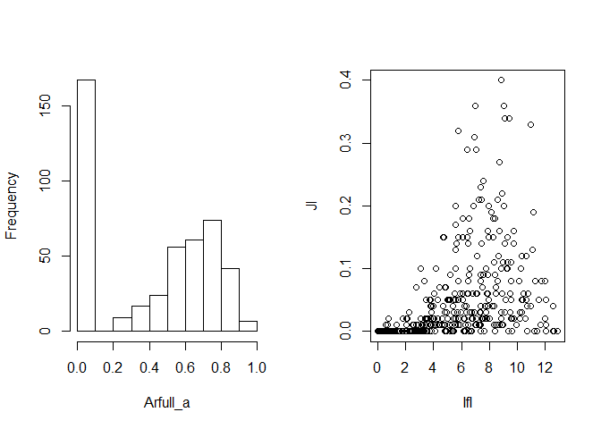
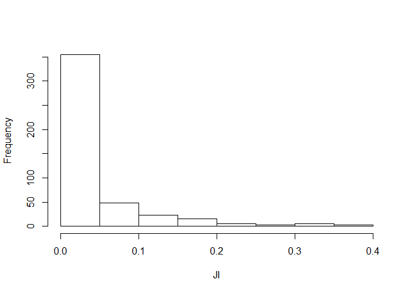
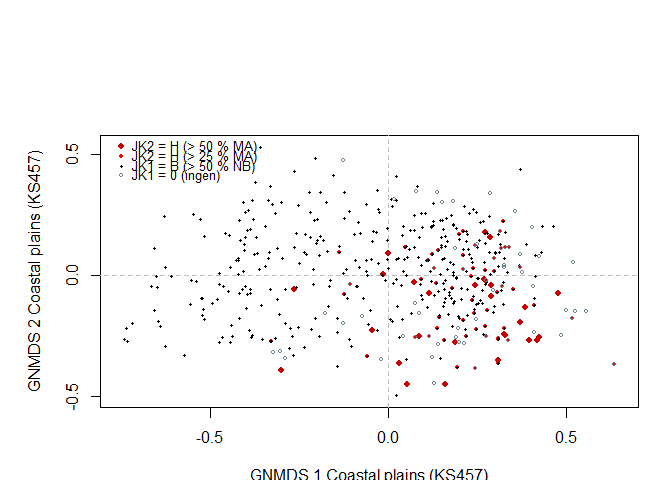
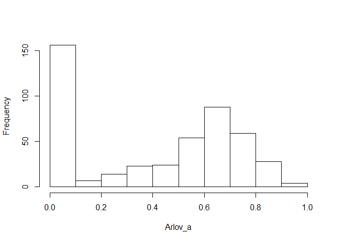
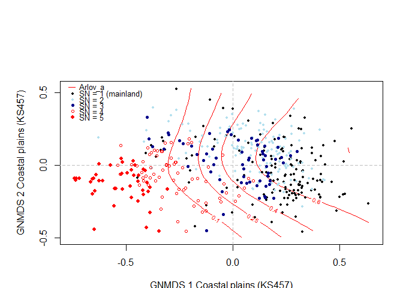
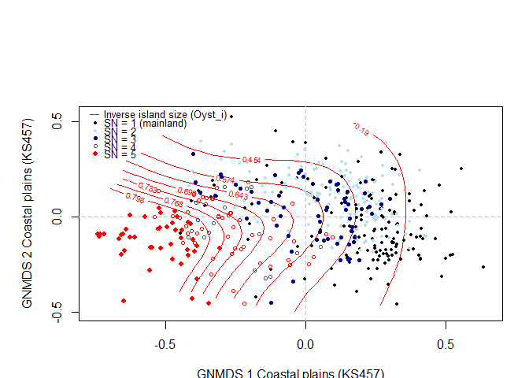

Landscape analysis example
================
Trond Simensen
03 11 2019

### Analysis of variation of landscape properties

# Coastal plains

All four axes in the 4-dimensional GNMDS ordination of the KS457 dataset
were confirmed by DCA. GNMDS ordination had Procrustes SS = 0.0363 and
seven unstable OUs (which switched positions between the two best GNMDS
solutions).

<!-- -->

There were no visible artifacts in the ordination charts. The
correlation analysis, the vector charts and the iso-line charts show a
strong first axis related to land use (infrastructure and agricultural
character) that appears to be conditioned by an underlying
geo-ecological gradient from inner to outer coast. Second axis is
strongly related to
relief.

``` r
Description <- c("No commercial buildings", "No fisheries-related buildings", "PA built-up", "PA flat terrain", "PA regulated magazine", "PA road", "PA thick layer of till", "PA depressions", "PA convex terrain", "Terrain form TPI1, numerical, mean", "PA strong ocean current", "PA normal ocean current", "PA weak ocean current", "PA large river", "PA trail, path", "PA steep terrain/slope", "PA landslide soil", "No summer mountain pasture", "PA old buildings", "Terrain ruggedness VRM3, mean", "Altitudinal range", "PA lime-rich bedrock", "PA lime-poor bedrock geology", "PA reindeer husbandry facilities", "PA plutonic rock", "PA volcanic rock", "PA sedimentary rock", "PA metamorphic rock", "PA terrestrial area", "PA built-up area", "PA town/city area", "PA mire", "PA moderate slope", "No marine islands", "PA marine deposits", "PA power lines", "PA lacustrine deposits", "PA glaciofluvial deposits", "PA exposed bedrock", "PA freshwater lake", "No freshwater lake islands", "Hydrographic index, ER, mean", "PA river", "PA exposed coast", "PA sligyhtly exposed coast", "PA slightly protected coast", "No lakes", "No cultural heritage sites outdoors", "No technical heritage sites", "No marine cultural heritage sites", "No church ruins", "No ancient rock art sites", "No archeological heritage sites", "PA steep coast", "PA flat coast", "Coastal ruggedness, VRM3, mean", "Coastal ruggedness, coarse scale, VRM9, mean", "PA rugged coast", "PA smooth/flat coast", "Coastal complexity", "PA complex coastline", "PA simple coastline Gab_fi", "PA boreal heaths", "PA south facing terrain", "PA north facing terrain", "PA large buildings", "PA open areas", "PA coniferous forest", "PA mixed boreal forest", "PA arable land", "PA deciduous forest", "PA surface cultivated land", "Distance to mire, mean", "Distance to lake, mean", "Distance to coast, mean", "PA rugged terrain", "PA rugged terrain, TPI6", "PA impediment", "PA patchy open treeless area", "PA lichen heath", "PA dry heath/open areas", "PA moist/fresh heath/open areas", "PA unregistered heath/open areas", "Inverse island size")

corr.matrise <- cbind(corr.matrise, Description)
corr.matrise <- corr.matrise [ , c(1,6,2:5)]
```

<table class="table table-condensed">

<thead>

<tr>

<th style="text-align:left;">

Variable

</th>

<th style="text-align:left;">

Description

</th>

<th style="text-align:center;">

GNMDS1

</th>

<th style="text-align:center;">

GNMDS2

</th>

<th style="text-align:center;">

GNMDS3

</th>

<th style="text-align:center;">

GNMDS4

</th>

</tr>

</thead>

<tbody>

<tr>

<td style="text-align:left;">

Gab\_nae

</td>

<td style="text-align:left;">

No commercial buildings

</td>

<td style="text-align:center;">

<span style="font-weight: bold; color: brown">0.6345</span>

</td>

<td style="text-align:center;">

<span style="font-weight: plain; color: red">-0.1164</span>

</td>

<td style="text-align:center;">

<span style="font-weight: plain; color: black">-0.0294</span>

</td>

<td style="text-align:center;">

<span style="font-weight: plain; color: black">-0.0092</span>

</td>

</tr>

<tr>

<td style="text-align:left;">

Gab\_fi

</td>

<td style="text-align:left;">

No fisheries-related buildings

</td>

<td style="text-align:center;">

<span style="font-weight: plain; color: red">0.3166</span>

</td>

<td style="text-align:center;">

<span style="font-weight: plain; color: black">-0.0682</span>

</td>

<td style="text-align:center;">

<span style="font-weight: plain; color: black">0.1576</span>

</td>

<td style="text-align:center;">

<span style="font-weight: plain; color: black">-0.0607</span>

</td>

</tr>

<tr>

<td style="text-align:left;">

Gab\_a

</td>

<td style="text-align:left;">

PA built-up

</td>

<td style="text-align:center;">

<span style="font-weight: bold; color: brown">0.7328</span>

</td>

<td style="text-align:center;">

<span style="font-weight: plain; color: black">-0.0514</span>

</td>

<td style="text-align:center;">

<span style="font-weight: plain; color: black">-0.0632</span>

</td>

<td style="text-align:center;">

<span style="font-weight: plain; color: black">-0.0397</span>

</td>

</tr>

<tr>

<td style="text-align:left;">

Flat\_a

</td>

<td style="text-align:left;">

PA flat terrain

</td>

<td style="text-align:center;">

<span style="font-weight: plain; color: black">-0.0920</span>

</td>

<td style="text-align:center;">

<span style="font-weight: bold; color: brown">-0.5626</span>

</td>

<td style="text-align:center;">

<span style="font-weight: plain; color: black">0.2041</span>

</td>

<td style="text-align:center;">

<span style="font-weight: plain; color: black">0.1333</span>

</td>

</tr>

<tr>

<td style="text-align:left;">

Vmag\_a

</td>

<td style="text-align:left;">

PA regulated magazine

</td>

<td style="text-align:center;">

<span style="font-weight: bold; color: brown">0.6345</span>

</td>

<td style="text-align:center;">

<span style="font-weight: plain; color: red">-0.1164</span>

</td>

<td style="text-align:center;">

<span style="font-weight: plain; color: black">-0.0294</span>

</td>

<td style="text-align:center;">

<span style="font-weight: plain; color: black">-0.0092</span>

</td>

</tr>

<tr>

<td style="text-align:left;">

Vei\_b\_a

</td>

<td style="text-align:left;">

PA road

</td>

<td style="text-align:center;">

<span style="font-weight: plain; color: red">0.3166</span>

</td>

<td style="text-align:center;">

<span style="font-weight: plain; color: black">-0.0682</span>

</td>

<td style="text-align:center;">

<span style="font-weight: plain; color: black">0.1576</span>

</td>

<td style="text-align:center;">

<span style="font-weight: plain; color: black">-0.0607</span>

</td>

</tr>

<tr>

<td style="text-align:left;">

Ktkmo\_a

</td>

<td style="text-align:left;">

PA thick layer of till

</td>

<td style="text-align:center;">

<span style="font-weight: bold; color: brown">0.7328</span>

</td>

<td style="text-align:center;">

<span style="font-weight: plain; color: black">-0.0514</span>

</td>

<td style="text-align:center;">

<span style="font-weight: plain; color: black">-0.0632</span>

</td>

<td style="text-align:center;">

<span style="font-weight: plain; color: black">-0.0397</span>

</td>

</tr>

<tr>

<td style="text-align:left;">

Tpi1l\_a

</td>

<td style="text-align:left;">

PA depressions

</td>

<td style="text-align:center;">

<span style="font-weight: plain; color: black">-0.0920</span>

</td>

<td style="text-align:center;">

<span style="font-weight: bold; color: brown">-0.5626</span>

</td>

<td style="text-align:center;">

<span style="font-weight: plain; color: black">0.2041</span>

</td>

<td style="text-align:center;">

<span style="font-weight: plain; color: black">0.1333</span>

</td>

</tr>

<tr>

<td style="text-align:left;">

Tpi1h\_a

</td>

<td style="text-align:left;">

PA convex terrain

</td>

<td style="text-align:center;">

<span style="font-weight: bold; color: brown">0.6345</span>

</td>

<td style="text-align:center;">

<span style="font-weight: plain; color: red">-0.1164</span>

</td>

<td style="text-align:center;">

<span style="font-weight: plain; color: black">-0.0294</span>

</td>

<td style="text-align:center;">

<span style="font-weight: plain; color: black">-0.0092</span>

</td>

</tr>

<tr>

<td style="text-align:left;">

Tpi1\_mp

</td>

<td style="text-align:left;">

Terrain form TPI1, numerical, mean

</td>

<td style="text-align:center;">

<span style="font-weight: plain; color: red">0.3166</span>

</td>

<td style="text-align:center;">

<span style="font-weight: plain; color: black">-0.0682</span>

</td>

<td style="text-align:center;">

<span style="font-weight: plain; color: black">0.1576</span>

</td>

<td style="text-align:center;">

<span style="font-weight: plain; color: black">-0.0607</span>

</td>

</tr>

<tr>

<td style="text-align:left;">

Stroms\_a

</td>

<td style="text-align:left;">

PA strong ocean current

</td>

<td style="text-align:center;">

<span style="font-weight: bold; color: brown">0.7328</span>

</td>

<td style="text-align:center;">

<span style="font-weight: plain; color: black">-0.0514</span>

</td>

<td style="text-align:center;">

<span style="font-weight: plain; color: black">-0.0632</span>

</td>

<td style="text-align:center;">

<span style="font-weight: plain; color: black">-0.0397</span>

</td>

</tr>

<tr>

<td style="text-align:left;">

Stromn\_a

</td>

<td style="text-align:left;">

PA normal ocean current

</td>

<td style="text-align:center;">

<span style="font-weight: plain; color: black">-0.0920</span>

</td>

<td style="text-align:center;">

<span style="font-weight: bold; color: brown">-0.5626</span>

</td>

<td style="text-align:center;">

<span style="font-weight: plain; color: black">0.2041</span>

</td>

<td style="text-align:center;">

<span style="font-weight: plain; color: black">0.1333</span>

</td>

</tr>

<tr>

<td style="text-align:left;">

Stroml\_a

</td>

<td style="text-align:left;">

PA weak ocean current

</td>

<td style="text-align:center;">

<span style="font-weight: bold; color: brown">0.6345</span>

</td>

<td style="text-align:center;">

<span style="font-weight: plain; color: red">-0.1164</span>

</td>

<td style="text-align:center;">

<span style="font-weight: plain; color: black">-0.0294</span>

</td>

<td style="text-align:center;">

<span style="font-weight: plain; color: black">-0.0092</span>

</td>

</tr>

<tr>

<td style="text-align:left;">

River\_a

</td>

<td style="text-align:left;">

PA large river

</td>

<td style="text-align:center;">

<span style="font-weight: plain; color: red">0.3166</span>

</td>

<td style="text-align:center;">

<span style="font-weight: plain; color: black">-0.0682</span>

</td>

<td style="text-align:center;">

<span style="font-weight: plain; color: black">0.1576</span>

</td>

<td style="text-align:center;">

<span style="font-weight: plain; color: black">-0.0607</span>

</td>

</tr>

<tr>

<td style="text-align:left;">

Sti\_a

</td>

<td style="text-align:left;">

PA trail, path

</td>

<td style="text-align:center;">

<span style="font-weight: bold; color: brown">0.7328</span>

</td>

<td style="text-align:center;">

<span style="font-weight: plain; color: black">-0.0514</span>

</td>

<td style="text-align:center;">

<span style="font-weight: plain; color: black">-0.0632</span>

</td>

<td style="text-align:center;">

<span style="font-weight: plain; color: black">-0.0397</span>

</td>

</tr>

<tr>

<td style="text-align:left;">

Steep\_a

</td>

<td style="text-align:left;">

PA steep terrain/slope

</td>

<td style="text-align:center;">

<span style="font-weight: plain; color: black">-0.0920</span>

</td>

<td style="text-align:center;">

<span style="font-weight: bold; color: brown">-0.5626</span>

</td>

<td style="text-align:center;">

<span style="font-weight: plain; color: black">0.2041</span>

</td>

<td style="text-align:center;">

<span style="font-weight: plain; color: black">0.1333</span>

</td>

</tr>

<tr>

<td style="text-align:left;">

Kskred\_a

</td>

<td style="text-align:left;">

PA landslide soil

</td>

<td style="text-align:center;">

<span style="font-weight: bold; color: brown">0.6345</span>

</td>

<td style="text-align:center;">

<span style="font-weight: plain; color: red">-0.1164</span>

</td>

<td style="text-align:center;">

<span style="font-weight: plain; color: black">-0.0294</span>

</td>

<td style="text-align:center;">

<span style="font-weight: plain; color: black">-0.0092</span>

</td>

</tr>

<tr>

<td style="text-align:left;">

Setr\_s

</td>

<td style="text-align:left;">

No summer mountain pasture

</td>

<td style="text-align:center;">

<span style="font-weight: plain; color: red">0.3166</span>

</td>

<td style="text-align:center;">

<span style="font-weight: plain; color: black">-0.0682</span>

</td>

<td style="text-align:center;">

<span style="font-weight: plain; color: black">0.1576</span>

</td>

<td style="text-align:center;">

<span style="font-weight: plain; color: black">-0.0607</span>

</td>

</tr>

<tr>

<td style="text-align:left;">

Sefr\_a

</td>

<td style="text-align:left;">

PA old buildings

</td>

<td style="text-align:center;">

<span style="font-weight: bold; color: brown">0.7328</span>

</td>

<td style="text-align:center;">

<span style="font-weight: plain; color: black">-0.0514</span>

</td>

<td style="text-align:center;">

<span style="font-weight: plain; color: black">-0.0632</span>

</td>

<td style="text-align:center;">

<span style="font-weight: plain; color: black">-0.0397</span>

</td>

</tr>

<tr>

<td style="text-align:left;">

Rug3\_m

</td>

<td style="text-align:left;">

Terrain ruggedness VRM3, mean

</td>

<td style="text-align:center;">

<span style="font-weight: plain; color: black">-0.0920</span>

</td>

<td style="text-align:center;">

<span style="font-weight: bold; color: brown">-0.5626</span>

</td>

<td style="text-align:center;">

<span style="font-weight: plain; color: black">0.2041</span>

</td>

<td style="text-align:center;">

<span style="font-weight: plain; color: black">0.1333</span>

</td>

</tr>

<tr>

<td style="text-align:left;">

Rr1\_m

</td>

<td style="text-align:left;">

Altitudinal range

</td>

<td style="text-align:center;">

<span style="font-weight: bold; color: brown">0.6345</span>

</td>

<td style="text-align:center;">

<span style="font-weight: plain; color: red">-0.1164</span>

</td>

<td style="text-align:center;">

<span style="font-weight: plain; color: black">-0.0294</span>

</td>

<td style="text-align:center;">

<span style="font-weight: plain; color: black">-0.0092</span>

</td>

</tr>

<tr>

<td style="text-align:left;">

Brich\_a

</td>

<td style="text-align:left;">

PA lime-rich bedrock

</td>

<td style="text-align:center;">

<span style="font-weight: plain; color: red">0.3166</span>

</td>

<td style="text-align:center;">

<span style="font-weight: plain; color: black">-0.0682</span>

</td>

<td style="text-align:center;">

<span style="font-weight: plain; color: black">0.1576</span>

</td>

<td style="text-align:center;">

<span style="font-weight: plain; color: black">-0.0607</span>

</td>

</tr>

<tr>

<td style="text-align:left;">

Bpoor\_a

</td>

<td style="text-align:left;">

PA lime-poor bedrock geology

</td>

<td style="text-align:center;">

<span style="font-weight: bold; color: brown">0.7328</span>

</td>

<td style="text-align:center;">

<span style="font-weight: plain; color: black">-0.0514</span>

</td>

<td style="text-align:center;">

<span style="font-weight: plain; color: black">-0.0632</span>

</td>

<td style="text-align:center;">

<span style="font-weight: plain; color: black">-0.0397</span>

</td>

</tr>

<tr>

<td style="text-align:left;">

Rd\_anl\_a

</td>

<td style="text-align:left;">

PA reindeer husbandry facilities

</td>

<td style="text-align:center;">

<span style="font-weight: plain; color: black">-0.0920</span>

</td>

<td style="text-align:center;">

<span style="font-weight: bold; color: brown">-0.5626</span>

</td>

<td style="text-align:center;">

<span style="font-weight: plain; color: black">0.2041</span>

</td>

<td style="text-align:center;">

<span style="font-weight: plain; color: black">0.1333</span>

</td>

</tr>

<tr>

<td style="text-align:left;">

Bplu\_a

</td>

<td style="text-align:left;">

PA plutonic rock

</td>

<td style="text-align:center;">

<span style="font-weight: bold; color: brown">0.6345</span>

</td>

<td style="text-align:center;">

<span style="font-weight: plain; color: red">-0.1164</span>

</td>

<td style="text-align:center;">

<span style="font-weight: plain; color: black">-0.0294</span>

</td>

<td style="text-align:center;">

<span style="font-weight: plain; color: black">-0.0092</span>

</td>

</tr>

<tr>

<td style="text-align:left;">

Bvul\_a

</td>

<td style="text-align:left;">

PA volcanic rock

</td>

<td style="text-align:center;">

<span style="font-weight: plain; color: red">0.3166</span>

</td>

<td style="text-align:center;">

<span style="font-weight: plain; color: black">-0.0682</span>

</td>

<td style="text-align:center;">

<span style="font-weight: plain; color: black">0.1576</span>

</td>

<td style="text-align:center;">

<span style="font-weight: plain; color: black">-0.0607</span>

</td>

</tr>

<tr>

<td style="text-align:left;">

Bavstn\_a

</td>

<td style="text-align:left;">

PA sedimentary rock

</td>

<td style="text-align:center;">

<span style="font-weight: bold; color: brown">0.7328</span>

</td>

<td style="text-align:center;">

<span style="font-weight: plain; color: black">-0.0514</span>

</td>

<td style="text-align:center;">

<span style="font-weight: plain; color: black">-0.0632</span>

</td>

<td style="text-align:center;">

<span style="font-weight: plain; color: black">-0.0397</span>

</td>

</tr>

<tr>

<td style="text-align:left;">

Bomd\_a

</td>

<td style="text-align:left;">

PA metamorphic rock

</td>

<td style="text-align:center;">

<span style="font-weight: plain; color: black">-0.0920</span>

</td>

<td style="text-align:center;">

<span style="font-weight: bold; color: brown">-0.5626</span>

</td>

<td style="text-align:center;">

<span style="font-weight: plain; color: black">0.2041</span>

</td>

<td style="text-align:center;">

<span style="font-weight: plain; color: black">0.1333</span>

</td>

</tr>

<tr>

<td style="text-align:left;">

Land\_a

</td>

<td style="text-align:left;">

PA terrestrial area

</td>

<td style="text-align:center;">

<span style="font-weight: bold; color: brown">0.6345</span>

</td>

<td style="text-align:center;">

<span style="font-weight: plain; color: red">-0.1164</span>

</td>

<td style="text-align:center;">

<span style="font-weight: plain; color: black">-0.0294</span>

</td>

<td style="text-align:center;">

<span style="font-weight: plain; color: black">-0.0092</span>

</td>

</tr>

<tr>

<td style="text-align:left;">

Build\_a

</td>

<td style="text-align:left;">

PA built-up area

</td>

<td style="text-align:center;">

<span style="font-weight: plain; color: red">0.3166</span>

</td>

<td style="text-align:center;">

<span style="font-weight: plain; color: black">-0.0682</span>

</td>

<td style="text-align:center;">

<span style="font-weight: plain; color: black">0.1576</span>

</td>

<td style="text-align:center;">

<span style="font-weight: plain; color: black">-0.0607</span>

</td>

</tr>

<tr>

<td style="text-align:left;">

City\_a

</td>

<td style="text-align:left;">

PA town/city area

</td>

<td style="text-align:center;">

<span style="font-weight: bold; color: brown">0.7328</span>

</td>

<td style="text-align:center;">

<span style="font-weight: plain; color: black">-0.0514</span>

</td>

<td style="text-align:center;">

<span style="font-weight: plain; color: black">-0.0632</span>

</td>

<td style="text-align:center;">

<span style="font-weight: plain; color: black">-0.0397</span>

</td>

</tr>

<tr>

<td style="text-align:left;">

Mire\_a

</td>

<td style="text-align:left;">

PA mire

</td>

<td style="text-align:center;">

<span style="font-weight: plain; color: black">-0.0920</span>

</td>

<td style="text-align:center;">

<span style="font-weight: bold; color: brown">-0.5626</span>

</td>

<td style="text-align:center;">

<span style="font-weight: plain; color: black">0.2041</span>

</td>

<td style="text-align:center;">

<span style="font-weight: plain; color: black">0.1333</span>

</td>

</tr>

<tr>

<td style="text-align:left;">

Meant\_a

</td>

<td style="text-align:left;">

PA moderate slope

</td>

<td style="text-align:center;">

<span style="font-weight: bold; color: brown">0.6345</span>

</td>

<td style="text-align:center;">

<span style="font-weight: plain; color: red">-0.1164</span>

</td>

<td style="text-align:center;">

<span style="font-weight: plain; color: black">-0.0294</span>

</td>

<td style="text-align:center;">

<span style="font-weight: plain; color: black">-0.0092</span>

</td>

</tr>

<tr>

<td style="text-align:left;">

Maro\_s

</td>

<td style="text-align:left;">

No marine islands

</td>

<td style="text-align:center;">

<span style="font-weight: plain; color: red">0.3166</span>

</td>

<td style="text-align:center;">

<span style="font-weight: plain; color: black">-0.0682</span>

</td>

<td style="text-align:center;">

<span style="font-weight: plain; color: black">0.1576</span>

</td>

<td style="text-align:center;">

<span style="font-weight: plain; color: black">-0.0607</span>

</td>

</tr>

<tr>

<td style="text-align:left;">

Kmar\_a

</td>

<td style="text-align:left;">

PA marine deposits

</td>

<td style="text-align:center;">

<span style="font-weight: bold; color: brown">0.7328</span>

</td>

<td style="text-align:center;">

<span style="font-weight: plain; color: black">-0.0514</span>

</td>

<td style="text-align:center;">

<span style="font-weight: plain; color: black">-0.0632</span>

</td>

<td style="text-align:center;">

<span style="font-weight: plain; color: black">-0.0397</span>

</td>

</tr>

<tr>

<td style="text-align:left;">

Lled\_a

</td>

<td style="text-align:left;">

PA power lines

</td>

<td style="text-align:center;">

<span style="font-weight: plain; color: black">-0.0920</span>

</td>

<td style="text-align:center;">

<span style="font-weight: bold; color: brown">-0.5626</span>

</td>

<td style="text-align:center;">

<span style="font-weight: plain; color: black">0.2041</span>

</td>

<td style="text-align:center;">

<span style="font-weight: plain; color: black">0.1333</span>

</td>

</tr>

<tr>

<td style="text-align:left;">

Klac\_a

</td>

<td style="text-align:left;">

PA lacustrine deposits

</td>

<td style="text-align:center;">

<span style="font-weight: bold; color: brown">0.6345</span>

</td>

<td style="text-align:center;">

<span style="font-weight: plain; color: red">-0.1164</span>

</td>

<td style="text-align:center;">

<span style="font-weight: plain; color: black">-0.0294</span>

</td>

<td style="text-align:center;">

<span style="font-weight: plain; color: black">-0.0092</span>

</td>

</tr>

<tr>

<td style="text-align:left;">

Kelv\_a

</td>

<td style="text-align:left;">

PA glaciofluvial deposits

</td>

<td style="text-align:center;">

<span style="font-weight: plain; color: red">0.3166</span>

</td>

<td style="text-align:center;">

<span style="font-weight: plain; color: black">-0.0682</span>

</td>

<td style="text-align:center;">

<span style="font-weight: plain; color: black">0.1576</span>

</td>

<td style="text-align:center;">

<span style="font-weight: plain; color: black">-0.0607</span>

</td>

</tr>

<tr>

<td style="text-align:left;">

Kbf\_a

</td>

<td style="text-align:left;">

PA exposed bedrock

</td>

<td style="text-align:center;">

<span style="font-weight: bold; color: brown">0.7328</span>

</td>

<td style="text-align:center;">

<span style="font-weight: plain; color: black">-0.0514</span>

</td>

<td style="text-align:center;">

<span style="font-weight: plain; color: black">-0.0632</span>

</td>

<td style="text-align:center;">

<span style="font-weight: plain; color: black">-0.0397</span>

</td>

</tr>

<tr>

<td style="text-align:left;">

Lake\_a

</td>

<td style="text-align:left;">

PA freshwater lake

</td>

<td style="text-align:center;">

<span style="font-weight: plain; color: black">-0.0920</span>

</td>

<td style="text-align:center;">

<span style="font-weight: bold; color: brown">-0.5626</span>

</td>

<td style="text-align:center;">

<span style="font-weight: plain; color: black">0.2041</span>

</td>

<td style="text-align:center;">

<span style="font-weight: plain; color: black">0.1333</span>

</td>

</tr>

<tr>

<td style="text-align:left;">

Innoy\_s

</td>

<td style="text-align:left;">

No freshwater lake islands

</td>

<td style="text-align:center;">

<span style="font-weight: bold; color: brown">0.6345</span>

</td>

<td style="text-align:center;">

<span style="font-weight: plain; color: red">-0.1164</span>

</td>

<td style="text-align:center;">

<span style="font-weight: plain; color: black">-0.0294</span>

</td>

<td style="text-align:center;">

<span style="font-weight: plain; color: black">-0.0092</span>

</td>

</tr>

<tr>

<td style="text-align:left;">

Er\_m

</td>

<td style="text-align:left;">

Hydrographic index, ER, mean

</td>

<td style="text-align:center;">

<span style="font-weight: plain; color: red">0.3166</span>

</td>

<td style="text-align:center;">

<span style="font-weight: plain; color: black">-0.0682</span>

</td>

<td style="text-align:center;">

<span style="font-weight: plain; color: black">0.1576</span>

</td>

<td style="text-align:center;">

<span style="font-weight: plain; color: black">-0.0607</span>

</td>

</tr>

<tr>

<td style="text-align:left;">

R\_net\_a

</td>

<td style="text-align:left;">

PA river

</td>

<td style="text-align:center;">

<span style="font-weight: bold; color: brown">0.7328</span>

</td>

<td style="text-align:center;">

<span style="font-weight: plain; color: black">-0.0514</span>

</td>

<td style="text-align:center;">

<span style="font-weight: plain; color: black">-0.0632</span>

</td>

<td style="text-align:center;">

<span style="font-weight: plain; color: black">-0.0397</span>

</td>

</tr>

<tr>

<td style="text-align:left;">

Ekspve\_a

</td>

<td style="text-align:left;">

PA exposed coast

</td>

<td style="text-align:center;">

<span style="font-weight: plain; color: black">-0.0920</span>

</td>

<td style="text-align:center;">

<span style="font-weight: bold; color: brown">-0.5626</span>

</td>

<td style="text-align:center;">

<span style="font-weight: plain; color: black">0.2041</span>

</td>

<td style="text-align:center;">

<span style="font-weight: plain; color: black">0.1333</span>

</td>

</tr>

<tr>

<td style="text-align:left;">

Ekspmo\_a

</td>

<td style="text-align:left;">

PA sligyhtly exposed coast

</td>

<td style="text-align:center;">

<span style="font-weight: bold; color: brown">0.6345</span>

</td>

<td style="text-align:center;">

<span style="font-weight: plain; color: red">-0.1164</span>

</td>

<td style="text-align:center;">

<span style="font-weight: plain; color: black">-0.0294</span>

</td>

<td style="text-align:center;">

<span style="font-weight: plain; color: black">-0.0092</span>

</td>

</tr>

<tr>

<td style="text-align:left;">

Ekspbe\_a

</td>

<td style="text-align:left;">

PA slightly protected coast

</td>

<td style="text-align:center;">

<span style="font-weight: plain; color: red">0.3166</span>

</td>

<td style="text-align:center;">

<span style="font-weight: plain; color: black">-0.0682</span>

</td>

<td style="text-align:center;">

<span style="font-weight: plain; color: black">0.1576</span>

</td>

<td style="text-align:center;">

<span style="font-weight: plain; color: black">-0.0607</span>

</td>

</tr>

<tr>

<td style="text-align:left;">

Inns\_s

</td>

<td style="text-align:left;">

No lakes

</td>

<td style="text-align:center;">

<span style="font-weight: bold; color: brown">0.7328</span>

</td>

<td style="text-align:center;">

<span style="font-weight: plain; color: black">-0.0514</span>

</td>

<td style="text-align:center;">

<span style="font-weight: plain; color: black">-0.0632</span>

</td>

<td style="text-align:center;">

<span style="font-weight: plain; color: black">-0.0397</span>

</td>

</tr>

<tr>

<td style="text-align:left;">

Cul\_u\_s

</td>

<td style="text-align:left;">

No cultural heritage sites outdoors

</td>

<td style="text-align:center;">

<span style="font-weight: plain; color: black">-0.0920</span>

</td>

<td style="text-align:center;">

<span style="font-weight: bold; color: brown">-0.5626</span>

</td>

<td style="text-align:center;">

<span style="font-weight: plain; color: black">0.2041</span>

</td>

<td style="text-align:center;">

<span style="font-weight: plain; color: black">0.1333</span>

</td>

</tr>

<tr>

<td style="text-align:left;">

Cul\_t\_s

</td>

<td style="text-align:left;">

No technical heritage sites

</td>

<td style="text-align:center;">

<span style="font-weight: bold; color: brown">0.6345</span>

</td>

<td style="text-align:center;">

<span style="font-weight: plain; color: red">-0.1164</span>

</td>

<td style="text-align:center;">

<span style="font-weight: plain; color: black">-0.0294</span>

</td>

<td style="text-align:center;">

<span style="font-weight: plain; color: black">-0.0092</span>

</td>

</tr>

<tr>

<td style="text-align:left;">

Cul\_m\_s

</td>

<td style="text-align:left;">

No marine cultural heritage sites

</td>

<td style="text-align:center;">

<span style="font-weight: plain; color: red">0.3166</span>

</td>

<td style="text-align:center;">

<span style="font-weight: plain; color: black">-0.0682</span>

</td>

<td style="text-align:center;">

<span style="font-weight: plain; color: black">0.1576</span>

</td>

<td style="text-align:center;">

<span style="font-weight: plain; color: black">-0.0607</span>

</td>

</tr>

<tr>

<td style="text-align:left;">

Cul\_k\_s

</td>

<td style="text-align:left;">

No church ruins

</td>

<td style="text-align:center;">

<span style="font-weight: bold; color: brown">0.7328</span>

</td>

<td style="text-align:center;">

<span style="font-weight: plain; color: black">-0.0514</span>

</td>

<td style="text-align:center;">

<span style="font-weight: plain; color: black">-0.0632</span>

</td>

<td style="text-align:center;">

<span style="font-weight: plain; color: black">-0.0397</span>

</td>

</tr>

<tr>

<td style="text-align:left;">

Cul\_b\_s

</td>

<td style="text-align:left;">

No ancient rock art sites

</td>

<td style="text-align:center;">

<span style="font-weight: plain; color: black">-0.0920</span>

</td>

<td style="text-align:center;">

<span style="font-weight: bold; color: brown">-0.5626</span>

</td>

<td style="text-align:center;">

<span style="font-weight: plain; color: black">0.2041</span>

</td>

<td style="text-align:center;">

<span style="font-weight: plain; color: black">0.1333</span>

</td>

</tr>

<tr>

<td style="text-align:left;">

Cul\_a\_s

</td>

<td style="text-align:left;">

No archeological heritage sites

</td>

<td style="text-align:center;">

<span style="font-weight: bold; color: brown">0.6345</span>

</td>

<td style="text-align:center;">

<span style="font-weight: plain; color: red">-0.1164</span>

</td>

<td style="text-align:center;">

<span style="font-weight: plain; color: black">-0.0294</span>

</td>

<td style="text-align:center;">

<span style="font-weight: plain; color: black">-0.0092</span>

</td>

</tr>

<tr>

<td style="text-align:left;">

Cre\_b\_a

</td>

<td style="text-align:left;">

PA steep coast

</td>

<td style="text-align:center;">

<span style="font-weight: plain; color: red">0.3166</span>

</td>

<td style="text-align:center;">

<span style="font-weight: plain; color: black">-0.0682</span>

</td>

<td style="text-align:center;">

<span style="font-weight: plain; color: black">0.1576</span>

</td>

<td style="text-align:center;">

<span style="font-weight: plain; color: black">-0.0607</span>

</td>

</tr>

<tr>

<td style="text-align:left;">

Cre\_f\_a

</td>

<td style="text-align:left;">

PA flat coast

</td>

<td style="text-align:center;">

<span style="font-weight: bold; color: brown">0.7328</span>

</td>

<td style="text-align:center;">

<span style="font-weight: plain; color: black">-0.0514</span>

</td>

<td style="text-align:center;">

<span style="font-weight: plain; color: black">-0.0632</span>

</td>

<td style="text-align:center;">

<span style="font-weight: plain; color: black">-0.0397</span>

</td>

</tr>

<tr>

<td style="text-align:left;">

Crug3\_m

</td>

<td style="text-align:left;">

Coastal ruggedness, VRM3, mean

</td>

<td style="text-align:center;">

<span style="font-weight: plain; color: black">-0.0920</span>

</td>

<td style="text-align:center;">

<span style="font-weight: bold; color: brown">-0.5626</span>

</td>

<td style="text-align:center;">

<span style="font-weight: plain; color: black">0.2041</span>

</td>

<td style="text-align:center;">

<span style="font-weight: plain; color: black">0.1333</span>

</td>

</tr>

<tr>

<td style="text-align:left;">

Crug9\_m

</td>

<td style="text-align:left;">

Coastal ruggedness, coarse scale, VRM9, mean

</td>

<td style="text-align:center;">

<span style="font-weight: bold; color: brown">0.6345</span>

</td>

<td style="text-align:center;">

<span style="font-weight: plain; color: red">-0.1164</span>

</td>

<td style="text-align:center;">

<span style="font-weight: plain; color: black">-0.0294</span>

</td>

<td style="text-align:center;">

<span style="font-weight: plain; color: black">-0.0092</span>

</td>

</tr>

<tr>

<td style="text-align:left;">

Cr3\_u\_a

</td>

<td style="text-align:left;">

PA rugged coast

</td>

<td style="text-align:center;">

<span style="font-weight: plain; color: red">0.3166</span>

</td>

<td style="text-align:center;">

<span style="font-weight: plain; color: black">-0.0682</span>

</td>

<td style="text-align:center;">

<span style="font-weight: plain; color: black">0.1576</span>

</td>

<td style="text-align:center;">

<span style="font-weight: plain; color: black">-0.0607</span>

</td>

</tr>

<tr>

<td style="text-align:left;">

Cr3\_r\_a

</td>

<td style="text-align:left;">

PA smooth/flat coast

</td>

<td style="text-align:center;">

<span style="font-weight: bold; color: brown">0.7328</span>

</td>

<td style="text-align:center;">

<span style="font-weight: plain; color: black">-0.0514</span>

</td>

<td style="text-align:center;">

<span style="font-weight: plain; color: black">-0.0632</span>

</td>

<td style="text-align:center;">

<span style="font-weight: plain; color: black">-0.0397</span>

</td>

</tr>

<tr>

<td style="text-align:left;">

Ccom\_m

</td>

<td style="text-align:left;">

Coastal complexity

</td>

<td style="text-align:center;">

<span style="font-weight: plain; color: black">-0.0920</span>

</td>

<td style="text-align:center;">

<span style="font-weight: bold; color: brown">-0.5626</span>

</td>

<td style="text-align:center;">

<span style="font-weight: plain; color: black">0.2041</span>

</td>

<td style="text-align:center;">

<span style="font-weight: plain; color: black">0.1333</span>

</td>

</tr>

<tr>

<td style="text-align:left;">

C\_kk\_a

</td>

<td style="text-align:left;">

PA complex coastline

</td>

<td style="text-align:center;">

<span style="font-weight: bold; color: brown">0.6345</span>

</td>

<td style="text-align:center;">

<span style="font-weight: plain; color: red">-0.1164</span>

</td>

<td style="text-align:center;">

<span style="font-weight: plain; color: black">-0.0294</span>

</td>

<td style="text-align:center;">

<span style="font-weight: plain; color: black">-0.0092</span>

</td>

</tr>

<tr>

<td style="text-align:left;">

C\_ek\_a

</td>

<td style="text-align:left;">

PA simple coastline Gab\_fi

</td>

<td style="text-align:center;">

<span style="font-weight: plain; color: red">0.3166</span>

</td>

<td style="text-align:center;">

<span style="font-weight: plain; color: black">-0.0682</span>

</td>

<td style="text-align:center;">

<span style="font-weight: plain; color: black">0.1576</span>

</td>

<td style="text-align:center;">

<span style="font-weight: plain; color: black">-0.0607</span>

</td>

</tr>

<tr>

<td style="text-align:left;">

Bohei\_a

</td>

<td style="text-align:left;">

PA boreal heaths

</td>

<td style="text-align:center;">

<span style="font-weight: bold; color: brown">0.7328</span>

</td>

<td style="text-align:center;">

<span style="font-weight: plain; color: black">-0.0514</span>

</td>

<td style="text-align:center;">

<span style="font-weight: plain; color: black">-0.0632</span>

</td>

<td style="text-align:center;">

<span style="font-weight: plain; color: black">-0.0397</span>

</td>

</tr>

<tr>

<td style="text-align:left;">

Asp\_s\_a

</td>

<td style="text-align:left;">

PA south facing terrain

</td>

<td style="text-align:center;">

<span style="font-weight: plain; color: black">-0.0920</span>

</td>

<td style="text-align:center;">

<span style="font-weight: bold; color: brown">-0.5626</span>

</td>

<td style="text-align:center;">

<span style="font-weight: plain; color: black">0.2041</span>

</td>

<td style="text-align:center;">

<span style="font-weight: plain; color: black">0.1333</span>

</td>

</tr>

<tr>

<td style="text-align:left;">

Asp\_n\_a

</td>

<td style="text-align:left;">

PA north facing terrain

</td>

<td style="text-align:center;">

<span style="font-weight: bold; color: brown">0.6345</span>

</td>

<td style="text-align:center;">

<span style="font-weight: plain; color: red">-0.1164</span>

</td>

<td style="text-align:center;">

<span style="font-weight: plain; color: black">-0.0294</span>

</td>

<td style="text-align:center;">

<span style="font-weight: plain; color: black">-0.0092</span>

</td>

</tr>

<tr>

<td style="text-align:left;">

Abygg\_a

</td>

<td style="text-align:left;">

PA large buildings

</td>

<td style="text-align:center;">

<span style="font-weight: plain; color: red">0.3166</span>

</td>

<td style="text-align:center;">

<span style="font-weight: plain; color: black">-0.0682</span>

</td>

<td style="text-align:center;">

<span style="font-weight: plain; color: black">0.1576</span>

</td>

<td style="text-align:center;">

<span style="font-weight: plain; color: black">-0.0607</span>

</td>

</tr>

<tr>

<td style="text-align:left;">

Araaf\_a

</td>

<td style="text-align:left;">

PA open areas

</td>

<td style="text-align:center;">

<span style="font-weight: bold; color: brown">0.7328</span>

</td>

<td style="text-align:center;">

<span style="font-weight: plain; color: black">-0.0514</span>

</td>

<td style="text-align:center;">

<span style="font-weight: plain; color: black">-0.0632</span>

</td>

<td style="text-align:center;">

<span style="font-weight: plain; color: black">-0.0397</span>

</td>

</tr>

<tr>

<td style="text-align:left;">

Arbar\_a

</td>

<td style="text-align:left;">

PA coniferous forest

</td>

<td style="text-align:center;">

<span style="font-weight: plain; color: black">-0.0920</span>

</td>

<td style="text-align:center;">

<span style="font-weight: bold; color: brown">-0.5626</span>

</td>

<td style="text-align:center;">

<span style="font-weight: plain; color: black">0.2041</span>

</td>

<td style="text-align:center;">

<span style="font-weight: plain; color: black">0.1333</span>

</td>

</tr>

<tr>

<td style="text-align:left;">

Arbla\_a

</td>

<td style="text-align:left;">

PA mixed boreal forest

</td>

<td style="text-align:center;">

<span style="font-weight: bold; color: brown">0.6345</span>

</td>

<td style="text-align:center;">

<span style="font-weight: plain; color: red">-0.1164</span>

</td>

<td style="text-align:center;">

<span style="font-weight: plain; color: black">-0.0294</span>

</td>

<td style="text-align:center;">

<span style="font-weight: plain; color: black">-0.0092</span>

</td>

</tr>

<tr>

<td style="text-align:left;">

Arfull\_a

</td>

<td style="text-align:left;">

PA arable land

</td>

<td style="text-align:center;">

<span style="font-weight: plain; color: red">0.3166</span>

</td>

<td style="text-align:center;">

<span style="font-weight: plain; color: black">-0.0682</span>

</td>

<td style="text-align:center;">

<span style="font-weight: plain; color: black">0.1576</span>

</td>

<td style="text-align:center;">

<span style="font-weight: plain; color: black">-0.0607</span>

</td>

</tr>

<tr>

<td style="text-align:left;">

Arlov\_a

</td>

<td style="text-align:left;">

PA deciduous forest

</td>

<td style="text-align:center;">

<span style="font-weight: bold; color: brown">0.7328</span>

</td>

<td style="text-align:center;">

<span style="font-weight: plain; color: black">-0.0514</span>

</td>

<td style="text-align:center;">

<span style="font-weight: plain; color: black">-0.0632</span>

</td>

<td style="text-align:center;">

<span style="font-weight: plain; color: black">-0.0397</span>

</td>

</tr>

<tr>

<td style="text-align:left;">

Arover\_a

</td>

<td style="text-align:left;">

PA surface cultivated land

</td>

<td style="text-align:center;">

<span style="font-weight: plain; color: black">-0.0920</span>

</td>

<td style="text-align:center;">

<span style="font-weight: bold; color: brown">-0.5626</span>

</td>

<td style="text-align:center;">

<span style="font-weight: plain; color: black">0.2041</span>

</td>

<td style="text-align:center;">

<span style="font-weight: plain; color: black">0.1333</span>

</td>

</tr>

<tr>

<td style="text-align:left;">

Dismire

</td>

<td style="text-align:left;">

Distance to mire, mean

</td>

<td style="text-align:center;">

<span style="font-weight: bold; color: brown">0.6345</span>

</td>

<td style="text-align:center;">

<span style="font-weight: plain; color: red">-0.1164</span>

</td>

<td style="text-align:center;">

<span style="font-weight: plain; color: black">-0.0294</span>

</td>

<td style="text-align:center;">

<span style="font-weight: plain; color: black">-0.0092</span>

</td>

</tr>

<tr>

<td style="text-align:left;">

Dislake

</td>

<td style="text-align:left;">

Distance to lake, mean

</td>

<td style="text-align:center;">

<span style="font-weight: plain; color: red">0.3166</span>

</td>

<td style="text-align:center;">

<span style="font-weight: plain; color: black">-0.0682</span>

</td>

<td style="text-align:center;">

<span style="font-weight: plain; color: black">0.1576</span>

</td>

<td style="text-align:center;">

<span style="font-weight: plain; color: black">-0.0607</span>

</td>

</tr>

<tr>

<td style="text-align:left;">

Discoast

</td>

<td style="text-align:left;">

Distance to coast, mean

</td>

<td style="text-align:center;">

<span style="font-weight: bold; color: brown">0.7328</span>

</td>

<td style="text-align:center;">

<span style="font-weight: plain; color: black">-0.0514</span>

</td>

<td style="text-align:center;">

<span style="font-weight: plain; color: black">-0.0632</span>

</td>

<td style="text-align:center;">

<span style="font-weight: plain; color: black">-0.0397</span>

</td>

</tr>

<tr>

<td style="text-align:left;">

Guro\_t\_a

</td>

<td style="text-align:left;">

PA rugged terrain

</td>

<td style="text-align:center;">

<span style="font-weight: plain; color: black">-0.0920</span>

</td>

<td style="text-align:center;">

<span style="font-weight: bold; color: brown">-0.5626</span>

</td>

<td style="text-align:center;">

<span style="font-weight: plain; color: black">0.2041</span>

</td>

<td style="text-align:center;">

<span style="font-weight: plain; color: black">0.1333</span>

</td>

</tr>

<tr>

<td style="text-align:left;">

Tpi6l\_a

</td>

<td style="text-align:left;">

PA rugged terrain, TPI6

</td>

<td style="text-align:center;">

<span style="font-weight: bold; color: brown">0.6345</span>

</td>

<td style="text-align:center;">

<span style="font-weight: plain; color: red">-0.1164</span>

</td>

<td style="text-align:center;">

<span style="font-weight: plain; color: black">-0.0294</span>

</td>

<td style="text-align:center;">

<span style="font-weight: plain; color: black">-0.0092</span>

</td>

</tr>

<tr>

<td style="text-align:left;">

Sn\_imp

</td>

<td style="text-align:left;">

PA impediment

</td>

<td style="text-align:center;">

<span style="font-weight: plain; color: red">0.3166</span>

</td>

<td style="text-align:center;">

<span style="font-weight: plain; color: black">-0.0682</span>

</td>

<td style="text-align:center;">

<span style="font-weight: plain; color: black">0.1576</span>

</td>

<td style="text-align:center;">

<span style="font-weight: plain; color: black">-0.0607</span>

</td>

</tr>

<tr>

<td style="text-align:left;">

Sn\_flekk

</td>

<td style="text-align:left;">

PA patchy open treeless area

</td>

<td style="text-align:center;">

<span style="font-weight: bold; color: brown">0.7328</span>

</td>

<td style="text-align:center;">

<span style="font-weight: plain; color: black">-0.0514</span>

</td>

<td style="text-align:center;">

<span style="font-weight: plain; color: black">-0.0632</span>

</td>

<td style="text-align:center;">

<span style="font-weight: plain; color: black">-0.0397</span>

</td>

</tr>

<tr>

<td style="text-align:left;">

Sn\_lav

</td>

<td style="text-align:left;">

PA lichen heath

</td>

<td style="text-align:center;">

<span style="font-weight: plain; color: black">-0.0920</span>

</td>

<td style="text-align:center;">

<span style="font-weight: bold; color: brown">-0.5626</span>

</td>

<td style="text-align:center;">

<span style="font-weight: plain; color: black">0.2041</span>

</td>

<td style="text-align:center;">

<span style="font-weight: plain; color: black">0.1333</span>

</td>

</tr>

<tr>

<td style="text-align:left;">

Sn\_torr

</td>

<td style="text-align:left;">

PA dry heath/open areas

</td>

<td style="text-align:center;">

<span style="font-weight: bold; color: brown">0.6345</span>

</td>

<td style="text-align:center;">

<span style="font-weight: plain; color: red">-0.1164</span>

</td>

<td style="text-align:center;">

<span style="font-weight: plain; color: black">-0.0294</span>

</td>

<td style="text-align:center;">

<span style="font-weight: plain; color: black">-0.0092</span>

</td>

</tr>

<tr>

<td style="text-align:left;">

Sn\_frisk

</td>

<td style="text-align:left;">

PA moist/fresh heath/open areas

</td>

<td style="text-align:center;">

<span style="font-weight: plain; color: red">0.3166</span>

</td>

<td style="text-align:center;">

<span style="font-weight: plain; color: black">-0.0682</span>

</td>

<td style="text-align:center;">

<span style="font-weight: plain; color: black">0.1576</span>

</td>

<td style="text-align:center;">

<span style="font-weight: plain; color: black">-0.0607</span>

</td>

</tr>

<tr>

<td style="text-align:left;">

Sn\_ureg

</td>

<td style="text-align:left;">

PA unregistered heath/open areas

</td>

<td style="text-align:center;">

<span style="font-weight: bold; color: brown">0.7328</span>

</td>

<td style="text-align:center;">

<span style="font-weight: plain; color: black">-0.0514</span>

</td>

<td style="text-align:center;">

<span style="font-weight: plain; color: black">-0.0632</span>

</td>

<td style="text-align:center;">

<span style="font-weight: plain; color: black">-0.0397</span>

</td>

</tr>

<tr>

<td style="text-align:left;">

Oyst\_i

</td>

<td style="text-align:left;">

Inverse island
size

</td>

<td style="text-align:center;">

<span style="font-weight: plain; color: black">-0.0920</span>

</td>

<td style="text-align:center;">

<span style="font-weight: bold; color: brown">-0.5626</span>

</td>

<td style="text-align:center;">

<span style="font-weight: plain; color: black">0.2041</span>

</td>

<td style="text-align:center;">

<span style="font-weight: plain; color: black">0.1333</span>

</td>

</tr>

</tbody>

</table>

<!-- -->

<!-- -->

#### Complementary observations, axis 1 and 2:

  - One OU belongs to OI Class 6 (big city). This is Id 2916 Oslo city,
    which occupies the extreme position along GNMDS axis 1.
  - Agricultural intensity is associated with positive scores for GNMDS
    1, and a certain degree of infrastructure (similar to IfI ≈ 4) is a
    prerequisite for amount/degree of agricultural land use intensity.
    The relationship between JI and IfI is slightly unimodal, that is,
    the agricultural land use intensity is strongest when the
    amount/degree of infrastructure is relatively high, but decreases
    again when the amount/degree of infrastructure is very high.
  - The proportion of the area with deciduous forest (Arlov\_a) is 0 at
    the outer parts of the archipelago (SN = 5; there are 156 OUs with
    Arlov = 0), but increases inward towards larger islands and on the
    mainland.
  - The figure at the bottom left shows a clear (inverse) island size
    gradient, with a considerable variation in landscape characteristics
    related to the archipelago properties, first and foremost when the
    islands are smaller than 100 km2 (Oyst\_i \> 0.643). This opens the
    possibility that the complex gradient expressed on axis 1 is
    actually composed of two CLGs.
  - Among the 69 OUs in KS lacking infrastructure (IfI = 0), all of the
    56 as a largest island smaller than 1 km. Islands with significant
    infrastructure are generally much larger; one exception is Id 4038
    which has Oyst\_i = 0.8647 and IfI = 9.34. This polygon is located
    on the west and south part of Nøtterøy.
  - It is noteworthy that the topographic variables give such a strong
    signal when there is so little topography variation within costal
    plains.

<!-- -->

<!-- -->

<!-- -->

<!-- -->

<!-- -->

<!-- -->

<!-- -->

<!-- -->

<!-- -->

<!-- -->
