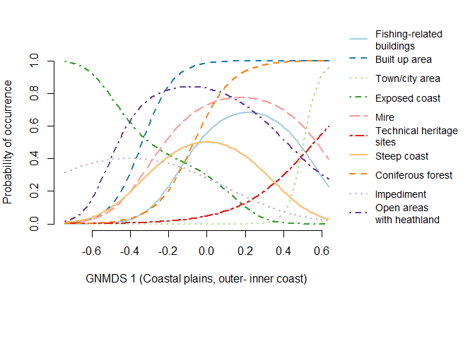

Landscape element response plots
================
Trond Simensen
03 11 2019

### Analysis of variation of landscape properties

# Coastal plains

All four axes in the 4-dimensional GNMDS ordination of the KS457 dataset
were confirmed by DCA. GNMDS ordination had Procrustes SS = 0.0363 and
seven unstable OUs (which switched positions between the two best GNMDS
solutions).

``` r
#kable(corr.matrise) %>%
#  kable_styling(bootstrap_options = c("striped", "hover", "condensed", font_size = 9))
kable(corr.matrise) 
```

<table>

<thead>

<tr>

<th style="text-align:left;">

Variable

</th>

<th style="text-align:left;">

Description

</th>

<th style="text-align:right;">

GNMDS1

</th>

<th style="text-align:right;">

GNMDS2

</th>

<th style="text-align:right;">

GNMDS3

</th>

<th style="text-align:right;">

GNMDS4

</th>

</tr>

</thead>

<tbody>

<tr>

<td style="text-align:left;">

Gab\_nae

</td>

<td style="text-align:left;">

No commercial buildings

</td>

<td style="text-align:right;">

0.6345

</td>

<td style="text-align:right;">

\-0.1164

</td>

<td style="text-align:right;">

\-0.0294

</td>

<td style="text-align:right;">

\-0.0092

</td>

</tr>

<tr>

<td style="text-align:left;">

Gab\_fi

</td>

<td style="text-align:left;">

No fisheries-related buildings

</td>

<td style="text-align:right;">

0.3166

</td>

<td style="text-align:right;">

\-0.0682

</td>

<td style="text-align:right;">

0.1576

</td>

<td style="text-align:right;">

\-0.0607

</td>

</tr>

<tr>

<td style="text-align:left;">

Gab\_a

</td>

<td style="text-align:left;">

PA built-up

</td>

<td style="text-align:right;">

0.7328

</td>

<td style="text-align:right;">

\-0.0514

</td>

<td style="text-align:right;">

\-0.0632

</td>

<td style="text-align:right;">

\-0.0397

</td>

</tr>

<tr>

<td style="text-align:left;">

Flat\_a

</td>

<td style="text-align:left;">

PA flat terrain

</td>

<td style="text-align:right;">

\-0.0920

</td>

<td style="text-align:right;">

\-0.5626

</td>

<td style="text-align:right;">

0.2041

</td>

<td style="text-align:right;">

0.1333

</td>

</tr>

<tr>

<td style="text-align:left;">

Vmag\_a

</td>

<td style="text-align:left;">

PA regulated magazine

</td>

<td style="text-align:right;">

0.0638

</td>

<td style="text-align:right;">

0.0458

</td>

<td style="text-align:right;">

\-0.0305

</td>

<td style="text-align:right;">

0.0313

</td>

</tr>

<tr>

<td style="text-align:left;">

Vei\_b\_a

</td>

<td style="text-align:left;">

PA road

</td>

<td style="text-align:right;">

0.6270

</td>

<td style="text-align:right;">

\-0.0403

</td>

<td style="text-align:right;">

0.0441

</td>

<td style="text-align:right;">

0.0764

</td>

</tr>

<tr>

<td style="text-align:left;">

Ktkmo\_a

</td>

<td style="text-align:left;">

PA thick layer of till

</td>

<td style="text-align:right;">

0.2496

</td>

<td style="text-align:right;">

0.0351

</td>

<td style="text-align:right;">

0.0825

</td>

<td style="text-align:right;">

0.2250

</td>

</tr>

<tr>

<td style="text-align:left;">

Tpi1l\_a

</td>

<td style="text-align:left;">

PA depressions

</td>

<td style="text-align:right;">

0.1171

</td>

<td style="text-align:right;">

0.5584

</td>

<td style="text-align:right;">

\-0.0046

</td>

<td style="text-align:right;">

\-0.0476

</td>

</tr>

<tr>

<td style="text-align:left;">

Tpi1h\_a

</td>

<td style="text-align:left;">

PA convex terrain

</td>

<td style="text-align:right;">

0.0115

</td>

<td style="text-align:right;">

0.4749

</td>

<td style="text-align:right;">

\-0.2350

</td>

<td style="text-align:right;">

\-0.2408

</td>

</tr>

<tr>

<td style="text-align:left;">

Tpi1\_mp

</td>

<td style="text-align:left;">

Terrain form TPI1, numerical, mean

</td>

<td style="text-align:right;">

\-0.0787

</td>

<td style="text-align:right;">

0.0753

</td>

<td style="text-align:right;">

\-0.1994

</td>

<td style="text-align:right;">

\-0.1974

</td>

</tr>

<tr>

<td style="text-align:left;">

Stroms\_a

</td>

<td style="text-align:left;">

PA strong ocean current

</td>

<td style="text-align:right;">

0.0130

</td>

<td style="text-align:right;">

\-0.0281

</td>

<td style="text-align:right;">

0.1729

</td>

<td style="text-align:right;">

0.1029

</td>

</tr>

<tr>

<td style="text-align:left;">

Stromn\_a

</td>

<td style="text-align:left;">

PA normal ocean current

</td>

<td style="text-align:right;">

\-0.5201

</td>

<td style="text-align:right;">

\-0.1313

</td>

<td style="text-align:right;">

0.1621

</td>

<td style="text-align:right;">

\-0.0064

</td>

</tr>

<tr>

<td style="text-align:left;">

Stroml\_a

</td>

<td style="text-align:left;">

PA weak ocean current

</td>

<td style="text-align:right;">

0.1040

</td>

<td style="text-align:right;">

0.1434

</td>

<td style="text-align:right;">

\-0.2647

</td>

<td style="text-align:right;">

0.0612

</td>

</tr>

<tr>

<td style="text-align:left;">

River\_a

</td>

<td style="text-align:left;">

PA large river

</td>

<td style="text-align:right;">

0.1955

</td>

<td style="text-align:right;">

\-0.1176

</td>

<td style="text-align:right;">

0.1526

</td>

<td style="text-align:right;">

0.1342

</td>

</tr>

<tr>

<td style="text-align:left;">

Sti\_a

</td>

<td style="text-align:left;">

PA trail, path

</td>

<td style="text-align:right;">

0.1018

</td>

<td style="text-align:right;">

\-0.0506

</td>

<td style="text-align:right;">

\-0.0624

</td>

<td style="text-align:right;">

0.0061

</td>

</tr>

<tr>

<td style="text-align:left;">

Steep\_a

</td>

<td style="text-align:left;">

PA steep terrain/slope

</td>

<td style="text-align:right;">

0.0664

</td>

<td style="text-align:right;">

0.6571

</td>

<td style="text-align:right;">

\-0.0831

</td>

<td style="text-align:right;">

\-0.0625

</td>

</tr>

<tr>

<td style="text-align:left;">

Kskred\_a

</td>

<td style="text-align:left;">

PA landslide soil

</td>

<td style="text-align:right;">

\-0.0134

</td>

<td style="text-align:right;">

0.2100

</td>

<td style="text-align:right;">

0.3115

</td>

<td style="text-align:right;">

0.1613

</td>

</tr>

<tr>

<td style="text-align:left;">

Setr\_s

</td>

<td style="text-align:left;">

No summer mountain pasture

</td>

<td style="text-align:right;">

0.1523

</td>

<td style="text-align:right;">

0.0005

</td>

<td style="text-align:right;">

0.0472

</td>

<td style="text-align:right;">

\-0.0194

</td>

</tr>

<tr>

<td style="text-align:left;">

Sefr\_a

</td>

<td style="text-align:left;">

PA old buildings

</td>

<td style="text-align:right;">

0.5703

</td>

<td style="text-align:right;">

\-0.0920

</td>

<td style="text-align:right;">

\-0.0622

</td>

<td style="text-align:right;">

\-0.1033

</td>

</tr>

<tr>

<td style="text-align:left;">

Rug3\_m

</td>

<td style="text-align:left;">

Terrain ruggedness VRM3, mean

</td>

<td style="text-align:right;">

0.0404

</td>

<td style="text-align:right;">

0.6617

</td>

<td style="text-align:right;">

\-0.0259

</td>

<td style="text-align:right;">

\-0.1666

</td>

</tr>

<tr>

<td style="text-align:left;">

Rr1\_m

</td>

<td style="text-align:left;">

Altitudinal range

</td>

<td style="text-align:right;">

0.0752

</td>

<td style="text-align:right;">

0.7185

</td>

<td style="text-align:right;">

\-0.0293

</td>

<td style="text-align:right;">

0.0011

</td>

</tr>

<tr>

<td style="text-align:left;">

Brich\_a

</td>

<td style="text-align:left;">

PA lime-rich bedrock

</td>

<td style="text-align:right;">

0.0159

</td>

<td style="text-align:right;">

0.0992

</td>

<td style="text-align:right;">

\-0.1475

</td>

<td style="text-align:right;">

0.1324

</td>

</tr>

<tr>

<td style="text-align:left;">

Bpoor\_a

</td>

<td style="text-align:left;">

PA lime-poor bedrock geology

</td>

<td style="text-align:right;">

0.0641

</td>

<td style="text-align:right;">

\-0.0189

</td>

<td style="text-align:right;">

0.0535

</td>

<td style="text-align:right;">

\-0.2003

</td>

</tr>

<tr>

<td style="text-align:left;">

Rd\_anl\_a

</td>

<td style="text-align:left;">

PA reindeer husbandry facilities

</td>

<td style="text-align:right;">

0.0533

</td>

<td style="text-align:right;">

0.1007

</td>

<td style="text-align:right;">

0.0276

</td>

<td style="text-align:right;">

0.1174

</td>

</tr>

<tr>

<td style="text-align:left;">

Bplu\_a

</td>

<td style="text-align:left;">

PA plutonic rock

</td>

<td style="text-align:right;">

0.0541

</td>

<td style="text-align:right;">

\-0.1586

</td>

<td style="text-align:right;">

0.0252

</td>

<td style="text-align:right;">

\-0.3956

</td>

</tr>

<tr>

<td style="text-align:left;">

Bvul\_a

</td>

<td style="text-align:left;">

PA volcanic rock

</td>

<td style="text-align:right;">

0.1879

</td>

<td style="text-align:right;">

\-0.0016

</td>

<td style="text-align:right;">

\-0.0087

</td>

<td style="text-align:right;">

\-0.1046

</td>

</tr>

<tr>

<td style="text-align:left;">

Bavstn\_a

</td>

<td style="text-align:left;">

PA sedimentary rock

</td>

<td style="text-align:right;">

0.1844

</td>

<td style="text-align:right;">

\-0.1174

</td>

<td style="text-align:right;">

\-0.1346

</td>

<td style="text-align:right;">

0.1115

</td>

</tr>

<tr>

<td style="text-align:left;">

Bomd\_a

</td>

<td style="text-align:left;">

PA metamorphic rock

</td>

<td style="text-align:right;">

\-0.0386

</td>

<td style="text-align:right;">

0.1951

</td>

<td style="text-align:right;">

0.0493

</td>

<td style="text-align:right;">

0.1713

</td>

</tr>

<tr>

<td style="text-align:left;">

Land\_a

</td>

<td style="text-align:left;">

PA terrestrial area

</td>

<td style="text-align:right;">

0.6629

</td>

<td style="text-align:right;">

0.0369

</td>

<td style="text-align:right;">

0.0937

</td>

<td style="text-align:right;">

\-0.1296

</td>

</tr>

<tr>

<td style="text-align:left;">

Build\_a

</td>

<td style="text-align:left;">

PA built-up area

</td>

<td style="text-align:right;">

0.4657

</td>

<td style="text-align:right;">

\-0.1377

</td>

<td style="text-align:right;">

\-0.0752

</td>

<td style="text-align:right;">

\-0.0331

</td>

</tr>

<tr>

<td style="text-align:left;">

City\_a

</td>

<td style="text-align:left;">

PA town/city area

</td>

<td style="text-align:right;">

0.1699

</td>

<td style="text-align:right;">

\-0.0631

</td>

<td style="text-align:right;">

\-0.1038

</td>

<td style="text-align:right;">

0.0314

</td>

</tr>

<tr>

<td style="text-align:left;">

Mire\_a

</td>

<td style="text-align:left;">

PA mire

</td>

<td style="text-align:right;">

0.3114

</td>

<td style="text-align:right;">

0.0618

</td>

<td style="text-align:right;">

0.3063

</td>

<td style="text-align:right;">

\-0.1761

</td>

</tr>

<tr>

<td style="text-align:left;">

Meant\_a

</td>

<td style="text-align:left;">

PA moderate slope

</td>

<td style="text-align:right;">

0.1062

</td>

<td style="text-align:right;">

0.3618

</td>

<td style="text-align:right;">

\-0.2532

</td>

<td style="text-align:right;">

\-0.1399

</td>

</tr>

<tr>

<td style="text-align:left;">

Maro\_s

</td>

<td style="text-align:left;">

No marine islands

</td>

<td style="text-align:right;">

\-0.1609

</td>

<td style="text-align:right;">

\-0.1324

</td>

<td style="text-align:right;">

0.0874

</td>

<td style="text-align:right;">

\-0.4627

</td>

</tr>

<tr>

<td style="text-align:left;">

Kmar\_a

</td>

<td style="text-align:left;">

PA marine deposits

</td>

<td style="text-align:right;">

0.3888

</td>

<td style="text-align:right;">

\-0.1691

</td>

<td style="text-align:right;">

0.0652

</td>

<td style="text-align:right;">

0.3365

</td>

</tr>

<tr>

<td style="text-align:left;">

Lled\_a

</td>

<td style="text-align:left;">

PA power lines

</td>

<td style="text-align:right;">

0.6407

</td>

<td style="text-align:right;">

\-0.0074

</td>

<td style="text-align:right;">

0.0375

</td>

<td style="text-align:right;">

\-0.0425

</td>

</tr>

<tr>

<td style="text-align:left;">

Klac\_a

</td>

<td style="text-align:left;">

PA lacustrine deposits

</td>

<td style="text-align:right;">

0.0278

</td>

<td style="text-align:right;">

\-0.0492

</td>

<td style="text-align:right;">

0.0674

</td>

<td style="text-align:right;">

0.0588

</td>

</tr>

<tr>

<td style="text-align:left;">

Kelv\_a

</td>

<td style="text-align:left;">

PA glaciofluvial deposits

</td>

<td style="text-align:right;">

0.2298

</td>

<td style="text-align:right;">

0.0004

</td>

<td style="text-align:right;">

0.0094

</td>

<td style="text-align:right;">

0.1849

</td>

</tr>

<tr>

<td style="text-align:left;">

Kbf\_a

</td>

<td style="text-align:left;">

PA exposed bedrock

</td>

<td style="text-align:right;">

\-0.5130

</td>

<td style="text-align:right;">

0.1119

</td>

<td style="text-align:right;">

\-0.1193

</td>

<td style="text-align:right;">

\-0.1483

</td>

</tr>

<tr>

<td style="text-align:left;">

Lake\_a

</td>

<td style="text-align:left;">

PA freshwater lake

</td>

<td style="text-align:right;">

0.2853

</td>

<td style="text-align:right;">

0.0324

</td>

<td style="text-align:right;">

0.2846

</td>

<td style="text-align:right;">

\-0.2841

</td>

</tr>

<tr>

<td style="text-align:left;">

Innoy\_s

</td>

<td style="text-align:left;">

No freshwater lake islands

</td>

<td style="text-align:right;">

0.2519

</td>

<td style="text-align:right;">

0.0402

</td>

<td style="text-align:right;">

0.1403

</td>

<td style="text-align:right;">

\-0.2380

</td>

</tr>

<tr>

<td style="text-align:left;">

Er\_m

</td>

<td style="text-align:left;">

Hydrographic index, ER, mean

</td>

<td style="text-align:right;">

\-0.1692

</td>

<td style="text-align:right;">

\-0.0660

</td>

<td style="text-align:right;">

\-0.1416

</td>

<td style="text-align:right;">

\-0.2859

</td>

</tr>

<tr>

<td style="text-align:left;">

R\_net\_a

</td>

<td style="text-align:left;">

PA river

</td>

<td style="text-align:right;">

0.5439

</td>

<td style="text-align:right;">

0.1233

</td>

<td style="text-align:right;">

0.1754

</td>

<td style="text-align:right;">

0.0161

</td>

</tr>

<tr>

<td style="text-align:left;">

Ekspve\_a

</td>

<td style="text-align:left;">

PA exposed coast

</td>

<td style="text-align:right;">

\-0.4350

</td>

<td style="text-align:right;">

\-0.0564

</td>

<td style="text-align:right;">

0.2315

</td>

<td style="text-align:right;">

0.1983

</td>

</tr>

<tr>

<td style="text-align:left;">

Ekspmo\_a

</td>

<td style="text-align:left;">

PA sligyhtly exposed coast

</td>

<td style="text-align:right;">

\-0.3992

</td>

<td style="text-align:right;">

\-0.1357

</td>

<td style="text-align:right;">

0.1847

</td>

<td style="text-align:right;">

\-0.0639

</td>

</tr>

<tr>

<td style="text-align:left;">

Ekspbe\_a

</td>

<td style="text-align:left;">

PA slightly protected coast

</td>

<td style="text-align:right;">

0.0284

</td>

<td style="text-align:right;">

0.0154

</td>

<td style="text-align:right;">

\-0.2599

</td>

<td style="text-align:right;">

\-0.0083

</td>

</tr>

<tr>

<td style="text-align:left;">

Inns\_s

</td>

<td style="text-align:left;">

No lakes

</td>

<td style="text-align:right;">

0.1119

</td>

<td style="text-align:right;">

\-0.0461

</td>

<td style="text-align:right;">

0.4004

</td>

<td style="text-align:right;">

\-0.3517

</td>

</tr>

<tr>

<td style="text-align:left;">

Cul\_u\_s

</td>

<td style="text-align:left;">

No cultural heritage sites outdoors

</td>

<td style="text-align:right;">

0.2744

</td>

<td style="text-align:right;">

\-0.1048

</td>

<td style="text-align:right;">

\-0.1217

</td>

<td style="text-align:right;">

0.0378

</td>

</tr>

<tr>

<td style="text-align:left;">

Cul\_t\_s

</td>

<td style="text-align:left;">

No technical heritage sites

</td>

<td style="text-align:right;">

0.2435

</td>

<td style="text-align:right;">

0.0028

</td>

<td style="text-align:right;">

\-0.0328

</td>

<td style="text-align:right;">

0.0082

</td>

</tr>

<tr>

<td style="text-align:left;">

Cul\_m\_s

</td>

<td style="text-align:left;">

No marine cultural heritage sites

</td>

<td style="text-align:right;">

0.2090

</td>

<td style="text-align:right;">

0.0296

</td>

<td style="text-align:right;">

\-0.1025

</td>

<td style="text-align:right;">

\-0.1863

</td>

</tr>

<tr>

<td style="text-align:left;">

Cul\_k\_s

</td>

<td style="text-align:left;">

No church ruins

</td>

<td style="text-align:right;">

0.3534

</td>

<td style="text-align:right;">

\-0.1442

</td>

<td style="text-align:right;">

\-0.0394

</td>

<td style="text-align:right;">

\-0.0059

</td>

</tr>

<tr>

<td style="text-align:left;">

Cul\_b\_s

</td>

<td style="text-align:left;">

No ancient rock art sites

</td>

<td style="text-align:right;">

0.2314

</td>

<td style="text-align:right;">

\-0.0738

</td>

<td style="text-align:right;">

\-0.0586

</td>

<td style="text-align:right;">

0.0975

</td>

</tr>

<tr>

<td style="text-align:left;">

Cul\_a\_s

</td>

<td style="text-align:left;">

No archeological heritage sites

</td>

<td style="text-align:right;">

0.5134

</td>

<td style="text-align:right;">

\-0.0412

</td>

<td style="text-align:right;">

0.0209

</td>

<td style="text-align:right;">

0.0436

</td>

</tr>

<tr>

<td style="text-align:left;">

Cre\_b\_a

</td>

<td style="text-align:left;">

PA steep coast

</td>

<td style="text-align:right;">

0.0351

</td>

<td style="text-align:right;">

0.5233

</td>

<td style="text-align:right;">

0.2241

</td>

<td style="text-align:right;">

0.0719

</td>

</tr>

<tr>

<td style="text-align:left;">

Cre\_f\_a

</td>

<td style="text-align:left;">

PA flat coast

</td>

<td style="text-align:right;">

\-0.0716

</td>

<td style="text-align:right;">

\-0.5412

</td>

<td style="text-align:right;">

0.1673

</td>

<td style="text-align:right;">

\-0.0322

</td>

</tr>

<tr>

<td style="text-align:left;">

Crug3\_m

</td>

<td style="text-align:left;">

Coastal ruggedness, VRM3, mean

</td>

<td style="text-align:right;">

\-0.0147

</td>

<td style="text-align:right;">

0.6764

</td>

<td style="text-align:right;">

\-0.0566

</td>

<td style="text-align:right;">

\-0.0172

</td>

</tr>

<tr>

<td style="text-align:left;">

Crug9\_m

</td>

<td style="text-align:left;">

Coastal ruggedness, coarse scale, VRM9, mean

</td>

<td style="text-align:right;">

0.0205

</td>

<td style="text-align:right;">

0.7286

</td>

<td style="text-align:right;">

0.0134

</td>

<td style="text-align:right;">

0.0165

</td>

</tr>

<tr>

<td style="text-align:left;">

Cr3\_u\_a

</td>

<td style="text-align:left;">

PA rugged coast

</td>

<td style="text-align:right;">

0.0120

</td>

<td style="text-align:right;">

0.5767

</td>

<td style="text-align:right;">

0.0929

</td>

<td style="text-align:right;">

\-0.0299

</td>

</tr>

<tr>

<td style="text-align:left;">

Cr3\_r\_a

</td>

<td style="text-align:left;">

PA smooth/flat coast

</td>

<td style="text-align:right;">

0.1328

</td>

<td style="text-align:right;">

\-0.1676

</td>

<td style="text-align:right;">

0.1194

</td>

<td style="text-align:right;">

\-0.3568

</td>

</tr>

<tr>

<td style="text-align:left;">

Ccom\_m

</td>

<td style="text-align:left;">

Coastal complexity

</td>

<td style="text-align:right;">

0.1233

</td>

<td style="text-align:right;">

0.0012

</td>

<td style="text-align:right;">

0.1075

</td>

<td style="text-align:right;">

\-0.4223

</td>

</tr>

<tr>

<td style="text-align:left;">

C\_kk\_a

</td>

<td style="text-align:left;">

PA complex coastline

</td>

<td style="text-align:right;">

0.0370

</td>

<td style="text-align:right;">

\-0.1276

</td>

<td style="text-align:right;">

0.1500

</td>

<td style="text-align:right;">

\-0.5028

</td>

</tr>

<tr>

<td style="text-align:left;">

C\_ek\_a

</td>

<td style="text-align:left;">

PA simple coastline Gab\_fi

</td>

<td style="text-align:right;">

0.0708

</td>

<td style="text-align:right;">

0.1907

</td>

<td style="text-align:right;">

\-0.0039

</td>

<td style="text-align:right;">

0.3369

</td>

</tr>

<tr>

<td style="text-align:left;">

Bohei\_a

</td>

<td style="text-align:left;">

PA boreal heaths

</td>

<td style="text-align:right;">

0.2844

</td>

<td style="text-align:right;">

0.0965

</td>

<td style="text-align:right;">

0.4234

</td>

<td style="text-align:right;">

\-0.0554

</td>

</tr>

<tr>

<td style="text-align:left;">

Asp\_s\_a

</td>

<td style="text-align:left;">

PA south facing terrain

</td>

<td style="text-align:right;">

\-0.0277

</td>

<td style="text-align:right;">

\-0.0953

</td>

<td style="text-align:right;">

\-0.0417

</td>

<td style="text-align:right;">

\-0.1100

</td>

</tr>

<tr>

<td style="text-align:left;">

Asp\_n\_a

</td>

<td style="text-align:left;">

PA north facing terrain

</td>

<td style="text-align:right;">

\-0.1435

</td>

<td style="text-align:right;">

0.0227

</td>

<td style="text-align:right;">

0.0876

</td>

<td style="text-align:right;">

0.0632

</td>

</tr>

<tr>

<td style="text-align:left;">

Abygg\_a

</td>

<td style="text-align:left;">

PA large buildings

</td>

<td style="text-align:right;">

0.4676

</td>

<td style="text-align:right;">

\-0.1406

</td>

<td style="text-align:right;">

\-0.0750

</td>

<td style="text-align:right;">

\-0.0371

</td>

</tr>

<tr>

<td style="text-align:left;">

Araaf\_a

</td>

<td style="text-align:left;">

PA open areas

</td>

<td style="text-align:right;">

0.2580

</td>

<td style="text-align:right;">

\-0.0311

</td>

<td style="text-align:right;">

0.3528

</td>

<td style="text-align:right;">

\-0.1493

</td>

</tr>

<tr>

<td style="text-align:left;">

Arbar\_a

</td>

<td style="text-align:left;">

PA coniferous forest

</td>

<td style="text-align:right;">

0.5742

</td>

<td style="text-align:right;">

0.0267

</td>

<td style="text-align:right;">

\-0.1798

</td>

<td style="text-align:right;">

\-0.1160

</td>

</tr>

<tr>

<td style="text-align:left;">

Arbla\_a

</td>

<td style="text-align:left;">

PA mixed boreal forest

</td>

<td style="text-align:right;">

0.5456

</td>

<td style="text-align:right;">

0.0191

</td>

<td style="text-align:right;">

\-0.2502

</td>

<td style="text-align:right;">

\-0.0497

</td>

</tr>

<tr>

<td style="text-align:left;">

Arfull\_a

</td>

<td style="text-align:left;">

PA arable land

</td>

<td style="text-align:right;">

0.5974

</td>

<td style="text-align:right;">

\-0.1116

</td>

<td style="text-align:right;">

\-0.0122

</td>

<td style="text-align:right;">

0.1307

</td>

</tr>

<tr>

<td style="text-align:left;">

Arlov\_a

</td>

<td style="text-align:left;">

PA deciduous forest

</td>

<td style="text-align:right;">

0.5743

</td>

<td style="text-align:right;">

0.0956

</td>

<td style="text-align:right;">

\-0.0356

</td>

<td style="text-align:right;">

\-0.0475

</td>

</tr>

<tr>

<td style="text-align:left;">

Arover\_a

</td>

<td style="text-align:left;">

PA surface cultivated land

</td>

<td style="text-align:right;">

0.3461

</td>

<td style="text-align:right;">

0.0327

</td>

<td style="text-align:right;">

0.2269

</td>

<td style="text-align:right;">

\-0.0626

</td>

</tr>

<tr>

<td style="text-align:left;">

Dismire

</td>

<td style="text-align:left;">

Distance to mire, mean

</td>

<td style="text-align:right;">

\-0.3504

</td>

<td style="text-align:right;">

\-0.1510

</td>

<td style="text-align:right;">

\-0.2023

</td>

<td style="text-align:right;">

0.1649

</td>

</tr>

<tr>

<td style="text-align:left;">

Dislake

</td>

<td style="text-align:left;">

Distance to lake, mean

</td>

<td style="text-align:right;">

\-0.3049

</td>

<td style="text-align:right;">

\-0.1074

</td>

<td style="text-align:right;">

\-0.2768

</td>

<td style="text-align:right;">

0.2448

</td>

</tr>

<tr>

<td style="text-align:left;">

Discoast

</td>

<td style="text-align:left;">

Distance to coast, mean

</td>

<td style="text-align:right;">

\-0.3573

</td>

<td style="text-align:right;">

\-0.0455

</td>

<td style="text-align:right;">

0.2784

</td>

<td style="text-align:right;">

\-0.2392

</td>

</tr>

<tr>

<td style="text-align:left;">

Guro\_t\_a

</td>

<td style="text-align:left;">

PA rugged terrain

</td>

<td style="text-align:right;">

0.0282

</td>

<td style="text-align:right;">

0.5437

</td>

<td style="text-align:right;">

0.2286

</td>

<td style="text-align:right;">

\-0.0350

</td>

</tr>

<tr>

<td style="text-align:left;">

Tpi6l\_a

</td>

<td style="text-align:left;">

PA rugged terrain, TPI6

</td>

<td style="text-align:right;">

0.1665

</td>

<td style="text-align:right;">

0.1377

</td>

<td style="text-align:right;">

0.0645

</td>

<td style="text-align:right;">

0.1714

</td>

</tr>

<tr>

<td style="text-align:left;">

Sn\_imp

</td>

<td style="text-align:left;">

PA impediment

</td>

<td style="text-align:right;">

\-0.1980

</td>

<td style="text-align:right;">

0.1446

</td>

<td style="text-align:right;">

0.2950

</td>

<td style="text-align:right;">

0.1299

</td>

</tr>

<tr>

<td style="text-align:left;">

Sn\_flekk

</td>

<td style="text-align:left;">

PA patchy open treeless area

</td>

<td style="text-align:right;">

\-0.1862

</td>

<td style="text-align:right;">

0.1571

</td>

<td style="text-align:right;">

0.4446

</td>

<td style="text-align:right;">

\-0.0965

</td>

</tr>

<tr>

<td style="text-align:left;">

Sn\_lav

</td>

<td style="text-align:left;">

PA lichen heath

</td>

<td style="text-align:right;">

0.1057

</td>

<td style="text-align:right;">

\-0.0434

</td>

<td style="text-align:right;">

\-0.0359

</td>

<td style="text-align:right;">

0.0867

</td>

</tr>

<tr>

<td style="text-align:left;">

Sn\_torr

</td>

<td style="text-align:left;">

PA dry heath/open areas

</td>

<td style="text-align:right;">

\-0.0046

</td>

<td style="text-align:right;">

0.0888

</td>

<td style="text-align:right;">

0.4795

</td>

<td style="text-align:right;">

\-0.2194

</td>

</tr>

<tr>

<td style="text-align:left;">

Sn\_frisk

</td>

<td style="text-align:left;">

PA moist/fresh heath/open areas

</td>

<td style="text-align:right;">

0.0485

</td>

<td style="text-align:right;">

0.0720

</td>

<td style="text-align:right;">

0.4784

</td>

<td style="text-align:right;">

\-0.0170

</td>

</tr>

<tr>

<td style="text-align:left;">

Sn\_ureg

</td>

<td style="text-align:left;">

PA unregistered heath/open areas

</td>

<td style="text-align:right;">

0.3218

</td>

<td style="text-align:right;">

\-0.2076

</td>

<td style="text-align:right;">

\-0.0564

</td>

<td style="text-align:right;">

0.1267

</td>

</tr>

<tr>

<td style="text-align:left;">

Oyst\_i

</td>

<td style="text-align:left;">

Inverse island
size

</td>

<td style="text-align:right;">

\-0.5057

</td>

<td style="text-align:right;">

\-0.0913

</td>

<td style="text-align:right;">

\-0.1215

</td>

<td style="text-align:right;">

\-0.1944

</td>

</tr>

</tbody>

</table>

<!-- -->
